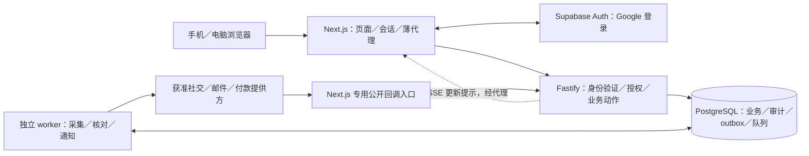

# Wringy 技术蓝图

已接受目标是模块化单体：同仓库维护 Next.js 页面、Fastify 业务 API 和独立 worker，以 PostgreSQL 保存业务事实。三角色共享业务模型及设计系统；采集、通知、付款核对异步执行，预算、授权与奖励确认由服务端统一裁定。[方向批准与理由](../phase-0/foundation/full-stack-proposal-v1.md) · [产品蓝图](PRD.md)。

## 1. 当前实现与接受目标

| 层面 | 已核查的仓库现状 | 接受目标／实施证据入口 |
|---|---|---|
| 产品与规划 | 有 [五阶段 specs](planning/README.md)、票据索引、业务规则和接口草稿 | 按阶段构建并留验收证据，文档存在不表示功能已实现 |
| UI 工程 | 已跟踪的应用 package／lockfile 位于 [设计系统展示](../phase-0/foundation/design-system-v2/app/package.json)，使用 Vite | M1 建 Next.js 业务原型并适配组件；展示工程不是三端业务应用 |
| 业务服务与数据 | 受版本控制内容未提供已实现的 Next.js 产品、Fastify API、业务迁移或 pg-boss worker | M2 建身份／保存／任务基础，M3 验证奖励业务；模块路径按实际实现建立 |
| CI 与验证 | [Planning checks](../.github/workflows/planning.yml) 运行 [规划检查](../scripts/check-planning.py) | 产品类型、集成、浏览器及恢复检查待建立，不能以规划检查替代 |
| 真实接入与生产 | 交接／specs 未提供真实社交、支付、容量或生产恢复通过证据 | M4 逐能力准入；M5 固定环境演练与具体发布批准 |

现状口径：2026-09-21 本地受版本控制文件（`git ls-files`）、上述 manifest／workflow 和 [仓库迁移记录](repository-status.md)。外部部署若无证据即为未验证。`implementation_status: greenfield-product` 只描述业务产品，不抹去已有设计资产与规划基础。

## 2. 技术栈与选择理由

下表承接 2026-09-15 接受的 [全栈方向](../phase-0/foundation/full-stack-proposal-v1.md)，不代表已经安装或联通。产品版本在实施切片按官方文档核验支持交集，写入锁文件、CI 与运行镜像；展示工程的 lockfile 不代表未来产品依赖。

| 责任 | 方向及状态 | 理由与边界 |
|---|---|---|
| 页面与会话 | Next.js App Router、React、TypeScript；已接受方向 | 公开活动的服务器 HTML／分享信息和三端工作台；统一会话适配，业务规则交 Fastify |
| 界面与语言 | 现有 shadcn、Tailwind、Wringy tokens；next-intl；已接受方向 | 复用组件和语言偏好；按组件需要处理客户端边界，不全站标 `use client` |
| 唯一业务 API | Fastify、TypeScript、受支持 Node.js LTS；已接受方向 | 集中授权、领域动作与资金约束，与页面及长任务分开运行 |
| 数据与登录 | Supabase PostgreSQL／Auth，仅 Google；`pg` 参数化 SQL与版本化迁移；已接受方向 | 使用关系约束、事务与身份能力；不加第二个数据库，不开放浏览器直写业务表 |
| 后台任务 | pg-boss、独立 worker、同一 PostgreSQL；已接受方向 | 持久化任务与恢复，共用领域代码；首版不引入 Redis 或消息集群 |
| 通知与更新 | 持久化站内通知、Resend；Fastify SSE＋重读；已接受方向 | 邮件可追踪、推送可补偿，数据库始终为事实源 |
| 运行部署 | Render 新加坡：web／private API／worker，Docker；已接受部署方向 | 一仓三个运行角色；数据库尽量邻近，具体区域、套餐及网络待验证 |
| 验证与交付 | Vitest、Playwright、真实本地 PostgreSQL 集成测试、GitHub Actions；已接受方向 | 纯规则、真实事务和用户旅程分层验证，staging 与生产分开 |
| 运行观测 | 结构化日志、健康及任务延迟告警；Sentry 仍候选 | 错误监控不能替代业务审计，敏感字段脱敏，实际集成待验 |
| 社交与支付 | TikTok、Instagram／Meta、YouTube 待逐能力验证；Stripe 优先调查 | 不代表已获生产准入；主体、用途、指标、国家与资金路径须有证据 |

无素材／成品视频上传系统，Supabase Storage 不是首版前置。后续确需附件时按实际批准范围增加私有存储，不顺带建设视频处理链。

## 3. 系统与信任边界

以下为接受目标，不是部署实况：

- 官网与 app/dashboard 逻辑分开，可由同一 Next.js 工程的路由和布局承担；不复制用户库或设计系统，不假定域名已配置。
- Next.js 负责页面、Google 回调、会话刷新与轻量代理；不直写业务表、不实现第二套计奖或付款后端。服务端渲染可调用内部 Fastify。
- Fastify 验证真实令牌与用户／组织／对象权限，不信任浏览器或代理声称的角色。worker 经同一领域模块执行已授权任务，不绕过不变量；它是另一进程，不是另一业务系统。
- 提供方回调经专用公开入口，原始体和签名头交 Fastify 验签、持久化去重再处理；Google 身份回调与付款回调分开。不建立任意 URL 或视频下载代理。
- PostgreSQL 是业务事实源。服务端密钥不进浏览器；迁移账号、运行账号及队列 schema 权限分离，客户端不能直写账本。具体 SQL／授权约束在阶段 spec 落实。

依据：[全栈请求与审核修正](../phase-0/foundation/full-stack-proposal-v1.md)、[M2](planning/specs/m2-spec.md)、[M4](planning/specs/m4-spec.md)。

## 4. 模块职责与依赖

下列是同一应用内的逻辑划分，不要求独立服务、包或通用命令总线。跨模块变更经拥有该事实的模块入口与事务协调，不能直接改另一模块的数据。

| 模块 | 拥有的事实与职责 | 依赖及不可越过的边界 |
|---|---|---|
| 身份与组织 | 用户、成员、角色范围、语言偏好 | 登录不等于参与资格，财务／运营权限不能自助提升 |
| 活动与规则版本 | 配置、规则快照、日历、发布就绪 | 依赖身份和能力／资金证据；不能自己认定备款或追溯改规则 |
| 投稿与账号验证 | 平台账号、控制证据、发布 ID、投稿与接受基线关系 | 依赖活动与授权；账号控制、数据许可、素材版权分别成立 |
| 计量 | 原始指标、覆盖窗、基线／快照、缺失原因与核验依据 | 依赖获准来源及投稿；不维护钱包、不依赖付款模块 |
| 申请、审核与申诉 | 有效次序、冻结增量、内容／风险决定、申诉与期限 | 协调规则、计量与账本；不能跳过申诉释放预留 |
| 奖励账本 | 可分配、预留、确认未付、已付的互斥记录及追加调整 | 只接收合法迁移；不抓社交数据，不把候补估计当应付 |
| 付款与对账 | 唯一义务、付款尝试、提供方引用、阶段证据及获准退款 | 消费确认义务；不决定奖励资格，不重复发放未知款或抹历史 |

通知、outbox、任务调度与审计支持这些模块；运营页面调用受控动作，不拥有“直接改余额”的旁路。提供方适配器转换外部证据，不裁定产品规则。[模块依据](../phase-0/foundation/architecture-content-rewards-v2.md) · [内部契约](../phase-0/foundation/external-interface-contracts-v1.md)。

**现有 README 菜单：** [设计系统](../phase-0/foundation/design-system-v2/README.md)、[展示工程](../phase-0/foundation/design-system-v2/app/README.md)、[展示测试](../phase-0/foundation/design-system-v2/app/tests/README.md)。业务模块 README 尚未建立；后续只将真实存在的入口加入本节，API、表结构与局部运行细节留在模块中。

## 5. 数据关系与主要事务流

逻辑关联为：用户／组织 → 活动及规则版本 → 平台发布与投稿 → 基线／计量快照 → 冻结申请 → 审核与申诉 → 账本及确认义务 → 付款尝试与核对证据。物理表及路由仍是 [实施草案](../phase-0/foundation/implementation-spec-content-rewards-v1.md)，按 M2／M3 纵向切片冻结和迁移，不能直接当可执行生产合同。

记录可追溯稳定 ID、组织／所有者、版本、时间、来源与证据；区分外部覆盖、获取、接受、计量终点及申请截止时间。`AuthAccount`、`MediaRef`、`MetricSnapshot`、`PaymentAttempt` 保持窄契约；`fixture`／`live` 在环境与记录层隔离，模拟义务不得进入真实付款。组织与父对象归属须在数据库约束中落实，不能只检查父 ID 存在。[M2 约束](planning/specs/m2-spec.md) · [M4 契约](planning/specs/m4-spec.md)。

**投稿与计量：** URL 归一到稳定发布 ID → 核对账号、许可、活动规则及跨活动限制 → 有同口径可信基线才接受 → worker 按窗口采样 → 保存原指标、覆盖窗与获取时间。窗口外观看不混入奖励；缺数、撤权、限流、回落和乱序保留各自状态与复核依据，不补零或覆盖历史。[M3](planning/specs/m3-spec.md) · [M4](planning/specs/m4-spec.md)。

**申请与预留：** 外部取样放在事务外；事务内按活动→投稿固定顺序加锁，再核对身份、归属、版本、截止、证据、单待处理及余量。取锁后用数据库实际时钟和活动单调序列确定次序；快照、预留迁移、追加账本、请求结果与 outbox 同事务提交。同键同参返回原结果和次序，同键异参拒绝；失败回滚不留下半笔预留。[M3 Implementation Decisions／AC03](planning/specs/m3-spec.md)。

**金额与账本：** 精确计算、显式币种、累计封顶后向下取整到分，再扣互斥占用是业务要求。实施草案采用整数最小单位存金额、精确定点存费率，具体 schema 随开工包冻结，不能让格式化显示反写业务值。分配／预留／确认／发放路径四分类守恒，汇总与分录一致；退款和争议调整追加依据，不伪装释放确认款。部分接受、申诉受理及最终释放的竞争也由事务裁定。[规则唯一源](../phase-0/foundation/campaign-defaults-v1.md) · [实施草案](../phase-0/foundation/implementation-spec-content-rewards-v1.md) · [M3](planning/specs/m3-spec.md)。

**审核与期限：** 内容、计量、申请及付款状态分开。按原规则和权限作决定，申诉中保留预留；受阻宽限记录原因与新截止，不改计量窗口或补队列。确认奖励产生唯一付款义务；确认／已付争议使用追加调整和核对，不静默改成普通拒绝。[M3](planning/specs/m3-spec.md) · [D01–D06](../phase-0/foundation/implementation-spec-content-rewards-v1.md)。

## 6. 异步任务、通知与付款恢复

业务事务写 outbox，提交后 relay 沿一条可靠路径投递 pg-boss。入队与标记投递尽可能共用受支持事务适配；可重复投递处仍靠稳定事件 ID 及业务唯一键去重。不并建第二条直接投递链，不把队列去重期当永久付款保护。[全栈任务决策](../phase-0/foundation/full-stack-proposal-v1.md)。

worker 执行采集、通知与付款核对，按平台全局配额限速、退避，失败保留重试和人工处理入口；扩容不能绕配额。站内通知持久化并按事件去重；邮件保存发送／失败／退信证据，未知发送结果过提供方去重窗口须先核对。

SSE 只传更新提示，前端重读持久化状态。重连、短轮询、跨实例传播、心跳、取消及代理无缓冲须在实际部署验证；未通过则明确用轮询。推送或邮件失败不改变资金事实。

付款 obligation ID 与 attempt ID 分开持久化，在外部调用前保存尝试及待发送事件；回调、查询和人工处置关联原尝试。pending／unknown 阻止新尝试，先查原交易；确认未付／失败后才评估受控重试。创作者收款账户可用款证据成立才标“已发放”，银行到账另记；乱序 pending 不倒退已核实状态，冲突进入核对。退款同样需要获准路径、唯一操作与未知结果核对。[M3](planning/specs/m3-spec.md) · [M4](planning/specs/m4-spec.md)。

必要金融义务与去重标识不能因队列清理、短期键到期或应用回滚消失；不因此无限保存原始社交数据。恢复先暂停新付款，核对原外部交易再恢复任务；数据库回退不能撤销已发生的外部支出。[M5 恢复验收](planning/specs/m5-spec.md)。

## 7. 身份、外部能力与数据边界

- **会话与组织：** Next.js 按请求建立会话客户端并统一刷新；Fastify 验证令牌及实际权限，资金写入还校验服务端有效会话／撤销状态。退出作用域须验证，不能只清前端 cookie；cookie 写操作核对 Origin／CSRF 边界。
- **缓存与披露：** 私有页面、余额、登录回调及带 Set-Cookie 响应不进共享缓存；公开活动只暴露公开字段，缓存余额不是预算保证。每次按对象归属授权，审核与财务分权。
- **社交准入：** Google 登录不等于 YouTube 授权；账号控制、数据授权、版权与奖励用途分别取证。不把平台统计无条件映成通用 views，不用粉丝比例或账号国家推算地域计费。
- **资金准入：** 实际主体、币种、国家、费用、备款、退款和付款路径须有证据。Stripe 是调查候选，不推定钱包／托管／垫款，不承诺全球覆盖。
- **能力开放：** 调查可得出“不可支持”并交付关闭路径；调查完成不等于能力通过。发布候选必须有至少一个完整通过的社交＋匹配支付组合；撤回能力时停新增但继续处理既有义务。
- **隐私与审计：** 凭据隔离、日志脱敏；保留操作人、原因、前后状态和证据。原始社交数据的保留／撤权／删除与必要金融审计分别制定。

来源：[M2 身份边界](planning/specs/m2-spec.md)、[M4 准入与数据处理](planning/specs/m4-spec.md)、[已接受全栈修正](../phase-0/foundation/full-stack-proposal-v1.md)。以上是要求，不是安全测试通过声明。

## 8. 部署、性能与验证

开发、测试／staging、生产环境隔离，凭据与 fixture 分开。常驻 API、worker 和监听连接按实际网络／TLS 配置；LISTEN 不经事务池，连接预算包括所有副本、队列、监听及平台余量。Render 与 Supabase 不假定自动形成私网。[部署与连接决策](../phase-0/foundation/full-stack-proposal-v1.md)。

先单 web 实例、单写主库；先测索引、分页、连接池、锁等待、慢查询及积压，再分别扩 API／worker 或数据库。扩 web 前验证缓存失效与事件传播，资金事务不先拆跨地域。Redis、搜索或微服务仅在明确瓶颈或新获批需求下重评。

| 验证维度 | 保留指标与状态 |
|---|---|
| 已接受压力假设 | 1 万注册创作者、每日 1,000 投稿、数百人同时操作；不是并发请求数或已测容量 |
| 待定量化提案 | 300 活跃用户、至少 30 天投稿种子；常规非第三方 API p95≤500ms，正常连接下已提交站内状态 5 秒内可见 |
| 正确性 | 争额不超配、组织不越权、奖励不重领／重付、汇总与分录一致；真实 PostgreSQL 集成验证 |
| 故障与恢复 | 任务崩溃、邮件失败、限流／撤权、通知断线、付款未知、备份恢复和回滚；RPO／RTO、新鲜度与告警响应目标待定 |
| 发布证据 | 固定版本、环境、数据量、混合操作频率、期望／实际结果、未决项及负责人；区分模拟、沙盒和 live |

来源：[全栈量化提案](../phase-0/foundation/full-stack-proposal-v1.md)、[A40](../phase-0/foundation/prd-content-rewards-v2.md)、[M5](planning/specs/m5-spec.md)。量化目标在关卡定案，不由文档归纳自动批准。阶段指标另按 [M2](planning/specs/m2-spec.md#success-measures) 的登录／保存及恢复、[M3](planning/specs/m3-spec.md#success-measures) 的冲突／重复／账本与通知、[M4](planning/specs/m4-spec.md#success-measures) 的逐主体／国家／币种能力和对账口径留证；未验证和模拟不能计为通过。

迁移采用兼容演进；发布时 worker 停领新任务，让在途任务完成或安全重领，保留镜像／配置版本，回退同时核验数据库兼容。观测包含探活、worker 心跳、连接数、最老积压、数据陈旧、付款未知和账本差异，告警交给真实负责人。运行手册与演练由 M5 承接。

## 9. 取舍、实施顺序与维护

| 当前选择 | 收益与成本 | 何时重评 |
|---|---|---|
| Next.js＋Fastify＋worker | 页面、业务、长任务独立运行；增加部署、代理和身份转交复杂度，未证明比单 Next.js 更快 | 实测维护／性能问题或新接受决定，不并行建两套后端 |
| PostgreSQL 支撑事实与任务 | 减少设施，支持事务及可靠投递；共享连接与 I/O 预算 | 测得队列、连接或业务负载瓶颈 |
| 模块化单体与窄适配 | 保持简单、复用成熟能力；须落实所有权及依赖检查 | 当前需求明确需要独立服务或新适配 |
| 原型到真实能力逐步交付 | 提早验证体验及规则、复用页面；模拟不能证明真实数据和资金可行 | 可行性证据推翻能力时回写 spec 与蓝图 |

M1 只有显式模拟；M2 不把演示账目导入正式数据；M3 用真实数据库证明不变量；M4 按证据替换适配、关闭未通过能力；M5 统验生产运营与恢复。可行性调查和准备按各票实际依赖尽早并行，不将阶段图当严格瀑布。阶段签核、接口、时间盒与验收留在 [五阶段 specs](planning/README.md)，依赖及状态以 GitHub 为准。

本文件拥有当前技术蓝图；[全栈方案](../phase-0/foundation/full-stack-proposal-v1.md)保留已接受方向的依据及核查记录，[默认规则](../phase-0/foundation/campaign-defaults-v1.md)仍拥有业务数值／算法。旧 Vite 业务前端、同进程任务、取整或付款口径“仍待定”等历史句不能覆盖较新决定。技术变更接受后原位更新本文，必要时在 [ADR](adr/README.md)保存理由，同步受影响 spec，不继续追加另一份“当前蓝图”。

实施完成时只凭代码、测试及部署证据更新第 1 节、模块 README 菜单与受影响边界，未验证部分继续标明。文件头约束 Wayfinder / to-spec：先刷新蓝图再 to-tickets，历史与任务流水不进入正文。
