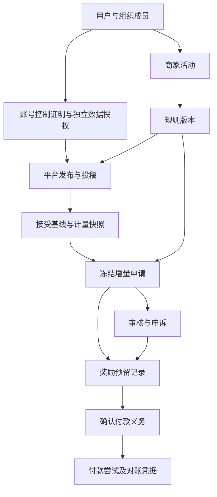

# Content Rewards架构草稿

**2026-09-15技术方向已确认：** 以[全栈方案](full-stack-proposal-v1.md)为准：Next.js页面、Fastify业务API、Supabase PostgreSQL/Auth及独立pg-boss worker。旧同进程/Vite业务前端建议被替代；业务模块及资金规则不变，尚未实现或验证。

**2026-09-14最新执行顺序：** 先依据官方文档准备TikTok、Instagram／Meta、YouTube与付款接口、模拟数据及内部测试；真实授权和联调放在上线前，不阻塞设计及模拟开发。规格冻结审批独立保留；模拟成功不解除生产数据、资金和准入门槛。见[外部接口内部契约](external-interface-contracts-v1.md)。

2026-09-14。用户在PRD交付后回复“好的”，授权继续规划；本稿未冻结，不是代码、数据库迁移或供应商批准。以[当前PRD](prd-content-rewards-v2.md)、[核心默认](campaign-defaults-v1.md)和[三角色蓝图](three-role-flows-v1.md)为业务依据，不改已确认规则，不按公司开发预算裁剪范围。

## 1. 一个应用，清楚的内部边界

**2026-09-14简化原则：** 遵循[创办人要求](../founder-inputs.md)，优先简单、高效、复用现成能力。下列模块是同一应用内的职责划分，不要求七个服务、独立包或通用框架；命令与事件示例不要求建立通用命令总线。先实现实际选定的数据／付款接入，共用必要接口即可，不预建多供应商路由、插件系统或自动切换。可靠任务需要重试与重复保护，但不因此引入独立消息集群。每一新增抽象须对应当前已确认需求；保留预算一致性、权限与对账控制。

采用模块化单体：同一仓库内划分职责明确的模块，先保持一个业务后端，不拆微服务。三角色前端共用[Linear＋shadcn设计系统](design-system-v2/README.md)及[三语规范](localization-v1.md)，导航与权限不同，金额和状态来源相同。资料库、运行环境和具体框架留到实施规格选择。

|模块|拥有的事实与职责|不能自行做的事|
|---|---|---|
|身份与组织|用户、组织成员、角色、范围授权、语言偏好|把登录成功当成活动参与资格|
|活动与规则版本|配置、参与版本、日历、就绪检查|替财务认定已备款或追溯改规则|
|投稿与账号验证|稳定平台作品ID、账号控制证明、投稿接受|把控制证明当API授权或版权证明|
|计量采集|授权来源、基线、样本、覆盖窗与核验依据|维护钱包或自行发钱|
|申请、审核与申诉|有效申请顺序、冻结快照、内容与风险结论|直接改余额或跳过申诉释放|
|奖励账本|可分配、预留、确认未付、已付的互斥归类|把估计、候补算作应付|
|付款与对账|付款义务、尝试、提供方结果、凭据|把未知当失败后直接重付|

业务写入只经所属模块的命令，不跨模块直接改记录。依赖从流程协调指向模块公开契约；计量不依赖付款，账本不抓社交数据，提供方适配器不决定奖励资格。模块规则文件与依赖检查须在实施时建立，当前不声称已有工具强制边界。

## 2. 逻辑关系

图示为业务关联，不是物理表或SQL。每项记录有稳定标识、所属组织或创作者、时间及版本。申请保存规则版本、来源样本、来源覆盖时间、截止点和冻结金额；页面刷新时间不能代替来源时间。同一人可有多个角色，切换时重新校验组织，不继承上一角色的权限。

## 3. 链接接受与计量

账号控制证明、数据读取授权、素材使用权各自记录，任何一项通过不替代其他两项。URL归一到平台发布ID，重复链接返回既有投稿，不重启窗口；商家明确允许时跨平台视频独立封顶已批准，自动跨活动复用仍待定。

接受链接要求可核验基线；基线不可得时保留待接受，不倒填开始时间。按默认源排除接受前观看，接受后计量7天。来源样本同时记录报告窗口和获取时间；缺失、撤权、配额或中断不记作零，不自动推断作弊。恢复采样、截止延迟和统计回落须按已展示规则复核。

平台和地域能力按验证结果开放。账号所在地区、语言和粉丝比例不是观看所在地；未取得同粒度地域数据不得生成地域计费结果。依据[研究报告第10–11节](../research/clipping-deep-v2/report.md)及[9月14日实测](../research/clipping-deep-v2/browser/onboarding-findings.md)，目前没有Wringy实际数据接入或真实付款验证证明。

## 4. 排队与金额不能分两次决定

服务端确认最低资格和可核验数据后，分配稳定有效申请时间及同刻次序；不采用客户端时间，重试不改变顺序。以活动为范围串行落实预留，审核完成顺序不得插队。队首数据等待、资格不成立及恢复后的公平性需按待冻结政策处理，不能临时改变优先级。

检查剩余额度、单条累计占用、重复申请与写入预留在同一事务完成：要么全部成功，要么全部不生效。部分申请在明确同意后再次核对余额；不足则返回新的可分配状态，不按过时页面强扣。只预留实际增量，不占单条最高额度。

币种独立保存，金额用整数最小货币单位；费率换算到分时的取整、精度和门槛边界仍待定，不能由代码默认截断。视频占用按互斥分类合计，确认后转已付不重复计入。RM100申请从预留转确认未付再转已付，可分配额始终是1,900，而非再扣两次。

拒绝待申诉保留预留；最终拒绝才释放。已确认或已付争议不走普通释放，使用附加调整记录并保留原决定。账本更正追加记录，不覆盖原金额；这项审计要求不等于无限保留所有个人或社交数据。

## 5. 同仓库后台任务与付款

事务同时写入待发送事件（outbox），后台任务在提交后执行通知、采集或付款调度；它仍属于同仓库应用，不据此拆出微服务。任务可能重复或中断，消费者按事件标识去重，失败可恢复。未经最终确认的申请不能产生付款义务。

逻辑契约示例采用版本号：`AcceptSubmission.v1`带投稿、规则与基线引用；`RequestClaim.v1`带申请人、截止快照及重复请求键；`ResolveAppeal.v1`带证据与结论；`StartPayout.v1`带义务及尝试标识。对应事件如`ClaimReserved.v1`、`RewardConfirmed.v1`、`PayoutReconciled.v1`。共同包含组织、操作者、事件标识与时间，均为提案，不是完整API规范。

付款保持稳定义务ID，每次尝试有独立attempt ID；请求、回调和查询都关联原尝试。结果未知锁住后续尝试，先对账：确认已付才完成，确认未付／失败才评估重试。即使提供方不支持重复保护，也不能盲目重发；是否可安全使用须验证。

各提供方适配器负责签名验证、重复回调、乱序事件、状态查询与凭据映射。旧处理中事件不能覆盖已确认付款；冲突进入对账。未选择提供方，不假设托管、钱包、平台垫款或已有马来西亚准入。

## 6. 权限与恢复

服务端在每次查询和写入验证用户、组织及活动范围；商家无权查其他商家私密资料，审核Admin只见被授权范围，财务执行另授。秘密凭据不进入前端或普通审计日志；保存最少必要收款资料，社交数据撤权和删除遵守实际授权要求。

失败恢复保留业务义务：暂停新申请或付款调度不删除已有预留、应付和支付尝试。上线前须验证备份恢复、任务重放及对账；涉及外部付款的回退是停发并核账，不是回滚数据库后假装款项未发生。

## 7. 三项关键选择及验证办法

优先顺序见[接入验证建议（未确认选型）](integration-recommendation-v1.md)，不替代本节验证门槛。

- **封顶单位：** 商家允许时跨平台按各平台视频独立封顶已批准；同平台同ID不重复计奖。跨活动复用仍待定，不设隐藏共享组。
- **数据路径：** 按文档准备Instagram／Meta、YouTube和TikTok的账号主人授权契约，真实联调阶段分别验证，不预先选定其中之一。只用另行授权的自有样本，核对所有权、许可、基线、成功样本、错误链接、地域缺失、配额及撤权；期望失败明确暂缺，不补零或伪造地区。
- **付款路径：** 比较候选方对马来西亚实际经营主体的准入、责任与对账能力，再选择。沙盒检查成功、明确失败、未知、重复及乱序通知；期望仅一次义务结清，未知阻止重付。沙盒成功不等于商用准入或真实到账。

验证尚未执行；当前可准备样本计划与契约模拟，不调用未授权账户。48小时审核目标、7日申诉和尾额不付按五项批准；取整、保留、付款时限等仍依PRD待决表。规则与实施规格获准后，可先用文档契约和模拟推进；真实路径在上线前验证，详见[开发切片计划](development-plan-content-rewards-v1.md)；本架构不是基础里程碑完成声明。

### 主审官方文档核对补充（2026-09-14）

主审本轮直接查看[TikTok Query Videos](https://developers.tiktok.com/docs/en/tiktok-api-v2-video-query)（页面更新2026-08-24）：使用已授权用户与视频ID，验证视频属于该用户，要求`video.list`范围，允许`view_count`字段。该端点能力不证明奖励用途获许可、Wringy应用获批或地区计量可用。

主审核对[YouTube videos.list](https://developers.google.com/youtube/v3/docs/videos/list)支持`statistics`及`snippet.channelId`；这不证明请求者控制频道，也不提供观看者地域证明。[Channel reports](https://developers.google.com/youtube/analytics/channel_reports)本轮仅确认文档存在，没有进一步核验字段。上述为主审文档核对记录，没有实际API请求或商业准入测试；后续自有授权样本验证仍按前述成功与失败清单执行。

审阅补充：排队等待部分同意不预留或阻塞、候补重新申请取得新有效时间、累计奖励取整后减互斥占用，以及“已发放／银行到账”两个不同付款状态，批准边界以[PRD第10节状态表](prd-content-rewards-v2.md#10-观察指标与发布阻塞项)承接已批准候补重提及2026-09-15六项规则，均不是实现事实。

最新五项批准以默认源为准：一次申请全部可用增量、同视频一个待处理；候补通知后重新申请取得新有效时间，不继承优先级。部分报价同意的精确时点、取整和付款最终阶段已于2026-09-15批准，见默认源。

具体技术栈、表约束、事务与接口候选见[实施规格草稿](implementation-spec-content-rewards-v1.md)；尚未批准选型或执行迁移，原有未决业务规则保留。

申请期限更新（2026-09-14已批准）：唯一依据见[默认源](campaign-defaults-v1.md#申请期限2026-09-14已批准)。分别保存计量终点、公布宽限和申请截止；受阻时记录原因、解除及最终数据可用时间并通知新截止。不得延长计量、回填队列或清除及时申请／已确认款。内部验收须覆盖正常截止和受阻恢复，尚未执行；内容保留及其他未决规则不变。

2026-09-15批准补充：2026-09-15：创办人在六项规则摘要及内容保留与延期申请衔接说明后回复“好的”，批准累计取整、最低资格比较、部分报价确认次序、内容保留、付款完成口径及同发布跨活动限制。批准不包含供应商开通、全规格冻结或代码／真实支付验证。 业务规则以[默认源](campaign-defaults-v1.md#补充业务规则2026-09-15已批准)为准；此前日期的未批准措辞仅记录当时状态。
