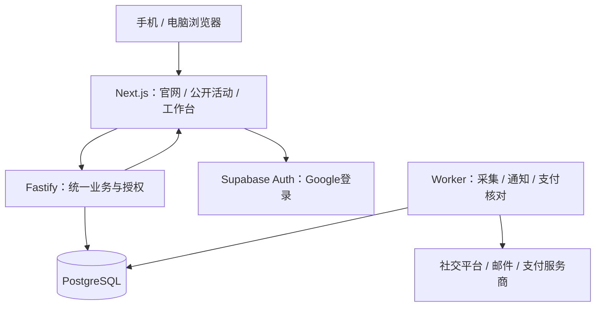

# Wringy全栈推荐与职责边界

2026-09-15 · 创办人在三路审核及主审结论后回复“好的就这样吧”，确认本文全栈方向。Next.js＋Fastify＋PostgreSQL/Supabase＋独立后台任务作为实施主案，不继续并行比较单Next.js备选。方向批准不是代码、容量验证、服务开通或全部实施规格冻结。

## 已确认产品要求

官网与app/dashboard分开；公开活动无需登录，参与需登录。手机和电脑网页，不做原生App。只用Google登录，一个人可创建/加入商家组织并作为creator，管理角色另行授权。EN/MS/简体中文及语言偏好沿用现有规范。邮件＋站内通知。运营完整覆盖查看异常、处理记录和受控重试。无素材/成品视频上传系统。马来西亚独立公司（非Belcort），国际使用和收付款是目标；首版单币种，沿用MYR为显式假设。业务规则沿用批准稿，上线前集中复核。

压力测试假设：1万注册creator、每日1000条投稿、数百人同时操作；拟把“数百”落实为300个活跃用户的混合操作测试，具体请求频率/数据规模在验收规格记录，不把注册数当并发数。均未测试。

## 推荐组合

|责任|推荐|边界与理由|
|---|---|---|
|页面|Next.js App Router＋React＋TypeScript|公开活动的服务器HTML、分享元信息与三角色工作台；不是为了图库迁移而选框架|
|样式组件|现有shadcn＋Tailwind及Wringy设计系统|复用tokens和组件；逐个检查浏览器依赖及客户端组件边界，不全站标use client|
|多语言|next-intl|复用现有语言字典/偏好，语言与国家/币种分开|
|业务API|Fastify＋TypeScript，Node.js受支持LTS|唯一的组织授权、活动、计奖、审核、账本和付款入口；Next.js不复制业务规则|
|数据库|Supabase托管PostgreSQL|关系约束、事务、账本、组织边界；pg参数化SQL及版本化SQL迁移，不再加第二个数据库|
|登录|Supabase Auth，仅启用Google|使用官方SDK会话/回调；Google登录不等于YouTube数据授权；管理员不能自助提升权限|
|任务|pg-boss＋独立worker进程|持久化任务、调度、重试；同仓库同业务模块不同进程，复用PostgreSQL，首版不引入Redis|
|通知|数据库站内通知＋Resend邮件|同一业务事件生成，事件键去重；记录待发/已发/失败/退信，用户语言模板；不承诺所有邮件都进入收件箱|
|界面更新|Fastify SSE事件通知＋按需重新读取|SSE是服务器单向推送变化；事件只提示刷新，数据库为事实；断线重连及短轮询补偿，隐藏页面降低刷新频率|
|运行部署|Render新加坡区：Next.js web、Fastify private API、后台worker|一个仓库三个运行角色；数据库优先邻近区域，实际Supabase区域/套餐创建前验证；Docker保持可迁移|
|错误与运行监控|Sentry候选＋结构化日志＋服务健康与任务延迟告警|错误工具集成待实测；业务审计独立存数据库，不用错误日志替代账本；敏感字段脱敏|
|测试与交付|Vitest、Playwright、真实本地PostgreSQL集成测试、GitHub Actions|框架兼容版本实施时核验锁定；CI测试与依赖边界检查，staging验收后经批准生产发布|
|支付|Stripe优先调查，未选定可用资金流|必须验证马来西亚主体收款、creator各国付款、退款及对账；可先mock，不把全球覆盖当事实|

Supabase Storage不是素材系统前置依赖；若后续确需申诉附件，再按获批范围增加私有存储。数据库驱动、测试库和Sentry等候选的精确版本、组合兼容性尚未验证。

## 应用结构与请求边界

逻辑上独立官网与app；推荐同一个Next.js项目区分布局与路由，可映射根域和app子域，不复制组件或用户库。具体域名尚未配置。后端同源API代理保持轻薄，Next.js不直写业务表；服务器渲染可直接调用内部Fastify。Fastify验证真实身份与组织权限，不信任浏览器或代理声称的角色。私有页面/余额响应禁止共享缓存；公开活动缓存不得承诺余额，申请时重新核验。

Next.js保留必要登录回调和会话适配，不开发第二套业务后端。使用官方Supabase服务器会话流程，明确cookie域、CSRF/Origin校验与退出行为；会话实现需独立测试。服务端密钥不进入浏览器，数据库业务schema不允许客户端直写。

## 为什么任务单独运行

例如采集Instagram超时，不应拖慢商家打开审核页。worker与API共用业务代码但可分别扩容。采用数据库outbox保证业务提交与待发送事件同事务；relay投递pg-boss可重试，stable事件ID及业务唯一键保护重复投递。任务队列不等于外部付款只发生一次：未知付款先查询原交易，不能重付。社交任务按平台配额限速并退避，不用增加worker突破API限制。

SSE连接需要验证代理不缓冲、重连、超时与跨实例事件传播；可用PostgreSQL通知作失效提示，丢消息后重新读持久化状态。通知不是资金事实或永久事件存储。此能力若未通过验收，明确使用短轮询，不能伪称实时。

## 运营后台的完整范围

- 审核、申诉、账号连接异常、计量缺失/过期、任务积压与失败清单。
- 付款待核对/未知/失败、回调记录、账本差异，关联活动、用户及原交易。
- 权限允许的重试、重新同步、人工复核与备注，记录操作者、原因、前后状态。
- 重试沿用既有去重键和授权校验；不能提供直接改余额、跳过审核或对未知付款“再付一次”的万能按钮。
- 平台运行告警给运营；创作者/商家只看到自己的业务通知和处理进度。

## 扩容顺序与验收

先测真实混合负载、数据库锁等待、慢查询、队列积压和第三方限额。首次压力测试拟用300活跃用户、万级账号及至少30天投稿量种子数据，涵盖同活动争预算、审核和通知；不是发布承诺。拟定内部目标：常规非第三方API p95≤500ms，已提交站内状态在正常连接下5秒内可见；最终按固定环境验收，外部计量另列新鲜度。

第一步索引/分页、连接池、分批查询；第二步分别增加web/API和worker容量；第三步按实测扩大数据库或加只读统计路径。首版保持单写主库，资金事务不拆跨地域；海外公开页面可缓存，私有/资金信息不缓存混用。只有测到明确瓶颈才引入Redis、独立搜索或拆业务服务。增加Next.js副本前验证缓存失效一致性。

上线前覆盖：重复/并发资金请求、跨组织越权、Google会话失效、跨实例通知、任务崩溃恢复、邮件失败、社交限流、付款未知、数据库备份恢复和应用回滚。数据库迁移采用先兼容后移除，不能只回滚应用却破坏旧schema。数据恢复目标与告警响应安排在上线检查中明确，不假设托管服务自动满足。

## 与先前草稿的变化

Vite继续作为现有设计系统展示工具；业务前端推荐改为Next.js。Next.js与Fastify分开运行，替代Fastify直接托管Vite产物建议。后台任务采用同仓库独立worker和pg-boss，替代同进程调度建议。无已上线业务代码，因此尚无业务迁移；设计系统适配和集成仍有实际工作。其他文件中的旧方案为历史候选，批准本方案后再统一改写实施规格，不并行实现两套方案。

## 本轮官方依据与限制

2026-09-15读取：
- [Next.js自托管](https://nextjs.org/docs/app/guides/self-hosting)：部署及多实例注意事项；不等于已部署。
- [shadcn Next.js安装](https://ui.shadcn.com/docs/installation/next)：支持组合，不等于现有所有组件已迁移。
- [Google登录](https://supabase.com/docs/guides/auth/social-login/auth-google)：官方支持，需Google项目及回调配置。
- [next-intl](https://next-intl.dev/docs/getting-started/app-router)：语言消息及偏好接入。
- [pg-boss官方仓库](https://github.com/timgit/pg-boss)：PostgreSQL任务库，事务/队列组合须实现验收。
- [Render区域](https://render.com/docs/regions)：新加坡可选；与Supabase之间不是自动私有网络，连接必须加密并限制权限。
- [Resend](https://resend.com/docs/introduction)：事务邮件及域名验证。
- [Stripe跨境付款](https://docs.stripe.com/connect/cross-border-payouts)：公开自助跨境平台地区不包含马来西亚；其他渠道/商业安排须核实，非断言永远不能跨境。

本方案技术方向已于2026-09-15确认，并已同步架构与实施规格入口。业务规则已确认并暂不重开；供应商账户、跨境资金流与上线验收不能通过一次架构确认冒充完成。

## 官方文档复核补充 — 2026-09-15

用户建议用Context7 MCP查最新资料；当前会话工具目录检索未找到Context7、resolve-library或query-docs可调用工具，因此本轮直接浏览官方文档，未使用Context7，未安装或调整MCP。

1. **数据库连接必须按运行方式配置。** [Supabase连接指南](https://supabase.com/docs/guides/database/connecting-to-postgres)推荐常驻后台使用直连，IPv4-only场景使用session pooler；transaction pooler适合短连接且有会话状态限制。Fastify、worker与监听连接不能随意共用一个事务池配置。部署时核验网络、SSL、连接总量；多副本池上限合计不能超数据库余量。
2. **账号隔离必须涵盖服务器缓存。** [Supabase SSR指南](https://supabase.com/docs/guides/auth/server-side/advanced-guide)要求请求级客户端及正确传播会话刷新响应头。私有页面/登录回调/带Set-Cookie响应不进共享缓存；代理层策略也需实测，不只设置一个应用header。
3. **页面扩容不等于复制容器即可。** [Next.js自托管指南](https://nextjs.org/docs/app/guides/self-hosting)要求检查流式响应全链路无缓冲、多实例缓存失效及部署版本协调。SSE需在最终代理部署验证；先单web实例，不预建Redis；需要多实例时才落实共享缓存或对相应路径禁用跨请求缓存。
4. **运行版本取支持交集。** [pg-boss当前README](https://github.com/timgit/pg-boss)列出PostgreSQL≥13、README对CommonJS提及Node≥22.12；本轮进一步检查当前包声明，其engines也要求Node≥22.12，不能只当CommonJS限制。[Fastify支持政策](https://fastify.dev/docs/latest/Reference/LTS/)要求结合对应主版本与Node支持线。此处是最低要求核查，不等于选定最低版本；实际安装选仍受支持版本，锁文件、CI与Docker一致，升级跑回归。文档兼容不等于集成已通过。
5. **推荐方向保持，批准状态不变。** Next.js＋Fastify＋PostgreSQL/Supabase＋独立worker仍为建议组合；没有据此声明“全栈已验证”或“最新所有版本均兼容”。尚需最小集成验证：Google会话→Fastify授权→数据库、事务→任务→邮件、跨实例事件与缓存、故障恢复、支付准入。

## 三路审核后的主审结论 — 2026-09-15

三份审核均返回，主审逐份阅读：[框架与登录](../research/stack-audit-2026-09-15/frontend-auth-audit.md)、[数据库与任务](../research/stack-audit-2026-09-15/database-jobs-audit.md)、[部署与运营](../research/stack-audit-2026-09-15/deployment-ops-audit.md)。主审另读Next.js业务接口指南、Supabase退出文档和pg-boss包声明。不是跨厂商封闭代码审查，也未执行集成/压力测试。

### 框架异议与取舍

前端审核建议优先评估Next.js单业务后端＋worker：当前只有网页，可以减少一次内部请求和服务间身份转交。这是成立的简化方案；Next.js能够承接业务入口，不能以“可扩展”三个字排除它。

主审暂保留Next.js＋Fastify＋worker作为推荐主案，理由限定为网页渲染、业务API、采集任务分别承担负载并可独立部署/扩容；运营完整性本身不要求Fastify，两案都能实现。保留Fastify会增加一个部署角色、代理和令牌验证边界，是明确成本；没有证据证明它在当前300活跃用户目标下性能更好。单Next.js＋worker是备选，不同时实现两套。Fastify已有方向批准，但整个组合现已于2026-09-15确认方向；无生产实现需要拆除。

### 纳入的具体修正

- 会话刷新由Next.js统一承担，Fastify只验证访问令牌及实际组织权限。退出不假定旧令牌立即失效：资金写入还要检查服务端有效会话/撤销状态，明确退出作用域和生效验收；cookie写接口检查Origin，公开缓存路径不刷新会话，不跨请求共享用户客户端。
- 私有Fastify的第三方回调经Next.js公开专用路由转发，保留原始体与签名头；Fastify验签、持久化去重后处理。Google回调在Next.js，不混入支付回调。限制请求大小，不增加视频下载代理。
- pg-boss使用受支持PostgreSQL与Node交集、独立队列schema、迁移与运行权限分离；常驻连接预算含API、worker、LISTEN专用会话和平台余量。LISTEN不经事务池，网络/TLS在目标平台验收。
- outbox relay的任务入队与标记已投递尽可能在同一pg连接事务完成，使用官方事务适配器；消费仍需业务幂等。只做一条可靠投递路径，不并建直接事务入队和outbox两套机制。
- 金融业务的唯一交易记录永久保留；不把队列或服务商短期去重键当永久保护。未知付款先查原交易，超过服务商去重保留期禁止盲重试。邮件也保存发送记录，未知结果过窗口先核对，乱序回调不倒退状态。
- SSE只传更新提示，断线后读取持久化状态；多实例传播、心跳、上游取消和代理无缓冲一起测。worker扩容遵守外部平台全局配额，不能只增加本地并发。
- 发布时worker停止领新任务，允许在途任务结束或安全重领；保留镜像与配置版本，回滚同时核查配置与数据库兼容。监控除Sentry外包含探活、worker心跳、连接数与积压年龄；任务卡住但没抛异常也能告警。

结论：技术主案仍可行，但“供应商有这个功能”只能支持进一步集成，不证明实际系统质量或容量。先前需求到验收的[对照表](../research/stack-audit-2026-09-15/acceptance-review.md)保持未执行状态。支付准入仍是独立未验证项。
