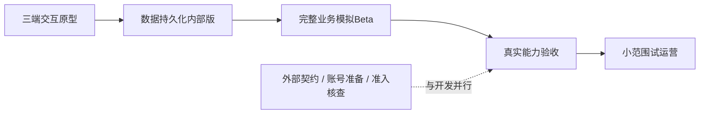

# Wringy五阶段开发地图

> 2026-09-16 更新：创办人改为现在完成全部阶段规格与票据。新版入口为 [全阶段规格与任务](../../../docs/planning/README.md)；本文较早的“后续阶段再细化”安排已被替代。GitHub Issues 是执行状态唯一来源；接口证据、实施批准与生产发布关卡仍保留。

2026-09-15 · 依据已确认产品与技术方向形成的开发安排，按创办人授权完成规划收尾，作为阶段安排基线。各阶段尚未开工；后续阶段详细规格在开工前完成，不提前伪称全部冻结。

## 交付总览

|阶段|创办人可以看到的结果|本阶段范围|依赖与退出验收|
|---|---|---|---|
|三端交互原型（M1）|在同一个原型切换商家、创作者、运营，走完模拟活动|Next.js/现有设计系统、公开活动、语言与手机布局、创建/投稿/计奖申请/审核申诉/模拟付款；本地持久化模拟数据|[原型规格](prototype-spec-v1.md)验收通过，创办人体验确认；无真实登录/采集/付款|
|可保存数据的内部版本（M2）|Google登录后创建活动和投稿，换浏览器/刷新数据仍在|基础工程、Fastify、PostgreSQL/Auth、组织权限、实际保存、任务及通知基础、测试/预发布环境|M1主要体验确认；实际Google/DB基础接入通过；跨组织隔离、刷新与任务恢复有证据|
|完整业务模拟Beta（M3）|三端可协作运行全部业务规则，运营处理异常|真实数据库上的计量模拟、申请/预留/审核/申诉/结案、模拟支付、持久通知、邮件测试及运营队列|M2基础稳定；并发、重复、期限、金额和失败恢复测试通过，完整旅程可重复|
|真实接口接入（M4）|指定平台真实观看数据与合格支付路径工作|按官方权限接入社交平台、真实主体/币种/国家支付验证、签名回调、对账和撤权/限流|契约及沙盒工作可与M2/M3并行；真实活动必须等待对应能力与业务验收通过；未通过能力保持关闭|
|小范围试运营（M5）|获邀商家和创作者可安全使用，并观察实际结果|上线前规则复核、邀请试用、压力/告警/备份恢复/回滚、运营执行与反馈|M4所开放能力通过，发布获批；未清资金有负责人。试运营结果决定扩大开放，不以人数增长假设自动过关|

## 阶段依赖

不是每阶段换一套代码。M1生产设计系统、页面及API形状由后续复用；模拟适配替换为Fastify API，业务金额最终以服务器为准。M1不构建第二个真实账本，也不为演示建设复杂通用模拟框架。

## 与既有开发切片对应

[切片计划](../development-plan-content-rewards-v1.md)是工程纵向拆解，本文件是创办人验收顺序，两者不是两套路线。

- 原型覆盖既有用户流程的视觉与交互，不把S0–S9正式业务实现标完成。
- 内部版本落实S0、S1及S2/S3的真实数据保存；S0中的所有生产恢复验证不因此提前标完。建立S4/S8的模拟接口，不假装已真实接入。M2不得把原型的申请、审核和付款状态直接落为正式账目；若提前启用这些写入，就必须同时满足相应S5–S8事务约束。
- 模拟Beta完成S4–S9内部逻辑及S2/S3剩余完整规则；通知和运营贯穿，不等最后补做。
- 真实接口替换S3/S4/S8提供方适配，并验证S2真实发布就绪、S9实际结清与退款边界；不重写核心流程。
- 试运营统验S0–S9及真实平台的闭环、恢复、告警和规则披露。

## 规格与决定安排

|规格层|现在安排|开工前必须补齐|
|---|---|---|
|全局|业务默认、设计系统、架构、数据与接口草案、PRD A01–A40|新决定写唯一源，已有批准不重复询问|
|原型|[完整首阶段规格](prototype-spec-v1.md)|创办人确认范围及验收；实施人员记录实际版本和启动说明|
|内部版本|仅Google、组织权限、保存与任务基础范围已定|精确schema/迁移、路由、会话、环境、回退和测试映射|
|模拟Beta|业务规则与失败边界已定|任务状态、期限调度、事务并发、通知、运营动作及测试用例|
|真实接入|验证领域与开放门槛已定|每个平台权限/指标/配额、支付主体/国家/费用/退款与提供方实际契约|
|试运营|小范围开放、观察及恢复范围已定|具体参与者、响应负责人、容量/恢复目标、发布与回滚安排|

第一阶段投入与中途检查点统一见[原型规格的一页实施约定](prototype-spec-v1.md#一页实施约定)，由代理采用规划时间盒，不另存第二套天数。后续阶段在前一阶段结果已知后给时间估算，不累加虚构总工期。

## 共同完成标准

每阶段交付可访问版本、已实现范围、验收结果、已知问题及下一阶段输入。未完成的状态不能只写“按钮待接”。M1评体验与状态演示；M2起才评真实数据和权限；M3评业务正确性；M4/M5评真实服务、运营与发布可用性。获批设计不等于业务测试通过，模拟付款不等于真实到账。

无需每阶段重开Wayfinder：沿本地图完成阶段规格、开发、演示及反馈。只有产品方向或范围大幅改变才重开探索；普通反馈在对应阶段规格变更记录处理。

2026-09-15规划结案：依据创办人“无需我决定的直接推进至Wayfinder结束”完成阶段安排。后续明确事项见[承接清单](follow-through-v1.md)，不要求每阶段重开Wayfinder。
