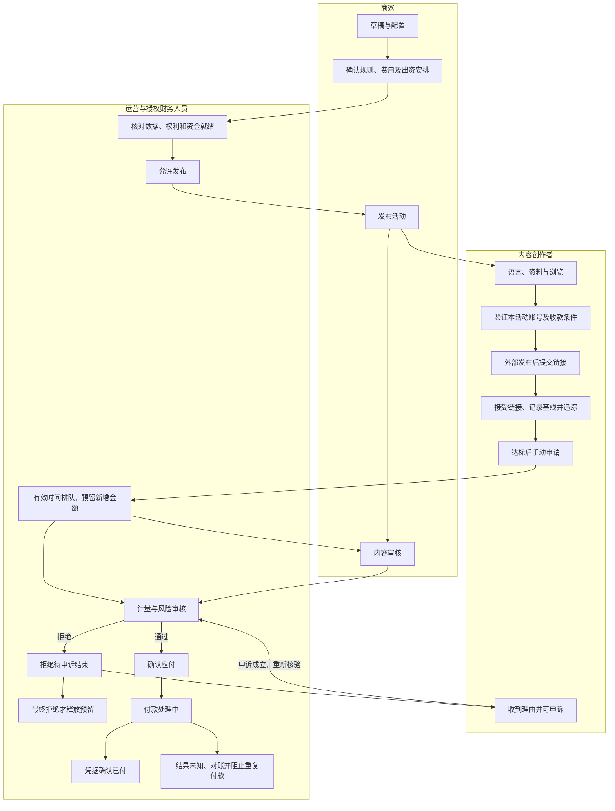

# 商家、内容创作者与运营的完整活动流程

2026-09-14，发现阶段蓝图。用户回复“好的”，授权继续起草三角色流程与页面；不等于批准完整PRD、实施或付款操作。本稿不以公司开发预算裁剪流程；活动奖励池仍必须真实落实，不能与公司预算或平台服务费混用。

依据：[创办人决定](../founder-inputs.md)、[核心默认配置](campaign-defaults-v1.md)、[商家配置表](campaign-configuration-v1.md)。核心默认及流程按已确认记录承接；48小时审核目标、7日历日申诉及未确认低于最低金额尾额不付已批准；保留时长、5工作日付款目标及补足办法仍是提案，不能包装为服务承诺。

## 1. 共用一套界面与业务事实

三角色遵循[Linear页面模式＋官方shadcn设计系统](design-system-v2/README.md)，使用Wringy配色和EN／BM／ZH语言规范。角色差异在导航、任务与权限，不另造三套皮肤。语言偏好可在首次进入时选择、设置中更改；关键规则按同一版本翻译，不因语言切换改变金额或资格。

列表用于找活动、投稿与申请；详情页展示规则、证据和处理记录；设置管理资料与权限。空状态、加载、权限不足、等待数据和失败分别说明原因及可执行动作。商家看到“待付款RM100”，创作者也应看到同一笔已确认待付款，不能一方称已付、另一方仍在审核。

## 2. 三角色主流程

图示是任务关系，不表示商家单独决定计量真伪。无申诉或申诉驳回并完成处理，才走最终释放；申诉成立保留原预留，不能重新竞争剩余预算。付款未知的对账结果只有确认已付才进入已付；确认失败／未付后由授权人员决定是否重试，仍未知则继续冻结该次付款。

## 3. 页面清单

|商家页面|目的与主要动作|必须展示的状态|
|---|---|---|
|活动列表／总览|新建、进入、筛选活动；看奖励池使用|草稿、待就绪、开放、暂停、停止收稿、结算中、已结案|
|活动配置与预览|选平台、语言、资格、素材权利、费率、门槛、封顶和日历；确认版本|缺项、规则冲突、数据能力不支持、待确认|
|发布检查／资金安排|确认付款主体、资金到位依据、费用及退款条件|待核验、未就绪、可发布；不能用填写金额代替资金落实|
|投稿与内容审核|查看本活动内容，按参与时规则通过或写明拒绝理由|待看、需补充、通过、拒绝待申诉|
|活动报告／结算|查看计量、申请、预留、应付、已付和剩余；提出续投|数据更新时间、争议金额、付款未知、可退余额待核定|

|内容创作者页面|目的与主要动作|必须展示的状态|
|---|---|---|
|入门／个人设置|选语言、补资料；先浏览后绑定|资料未完善与投稿资格分开|
|活动目录／详情|比较费率、门槛、封顶、素材、时间与规则版本|可参与、条件未满足、暂停、停止收稿；估计不保证付款|
|账号／收款设置|验证本活动允许的平台账号及付款条件|未绑定、待验证、通过、失效；具体方式以真实接入为准|
|提交链接／视频详情|外部发布后交URL，查看基线、追踪终点及累计奖励|链接待接受、计量中、数据暂缺、达标、封顶|
|奖励申请／申诉|手动申请增量；确认部分金额；查看证据并申诉|预留、候补未预留、审核、拒绝待申诉、确认待付|
|付款记录|查看每笔金额、状态与凭据|处理中、已付、失败、未知对账；不称钱包余额|

|运营页面|目的与主要动作|必须展示的状态|
|---|---|---|
|活动就绪检查|核实平台数据、规则授权及资金条件|阻塞原因、责任人、核验记录|
|资格／数据工作台|处理账号归属、链接基线、数据缺口|可核验、待补证、来源中断；禁止补造观看|
|申请与风险队列|按有效申请时间处理，维护预留，复核内容与计量|排队、预留、暂缓、审核结论及理由|
|申诉工作台|查看原规则和证据、复审并通知双方|受理、调查、成立／驳回；活跃争议不自动过期释放|
|财务结算／审计|授权财务确认应付、执行付款、对账和结案|各笔资金分类、付款凭据、未知结果、操作人记录|

## 4. 四种状态分别记录

|对象|状态主线|不能混同|
|---|---|---|
|内容|待审→通过／拒绝待申诉→复审结论|内容通过不等于观看合格|
|计量|待基线→追踪→待核验／数据暂缺→已核验|页面总观看不直接等于计酬观看|
|申请|未达标→可申请→预留审核／候补→已确认或最终拒绝|候补无预留；拒绝仍可能占用申诉预留|
|付款|未启动→处理中→已付／失败／未知|已确认应付不是已付；未知不是失败|

默认投稿开放14天；链接接受后按基线计新增7天观看。最后一天收下的链接仍走完整计量期。停止收稿、停止计量与结案是三个不同节点；未解决的争议与付款不能被活动结束按钮抹去。所有时钟用Asia/Kuala_Lumpur，工作日历另明示。

计量继续增长不自动生成新申请。手动申请冻结截止点、本次金额与证据；同视频仅一个待处理申请，追加只含未分配增量且达到最低申请金额，不重复扣除同笔已确认又已支付的款项，不因分次申请重置累计封顶。

## 5. 一笔RM100怎样贯穿三方

以下使用已确认产品默认，不代表真实出资：奖励池RM2,000，每千次合格观看RM5，最低申请RM5，单条累计封顶RM100。某视频在接受链接后的7天内新增20,000合格观看，计得RM100；此前观看不计。

|节点|可分配|预留|已确认待付|已付|
|---|---:|---:|---:|---:|
|已落实奖励池，尚无申请|2,000|0|0|0|
|有效申请预留RM100|1,900|100|0|0|
|审核通过确认应付|1,900|0|100|0|
|凭据确认付款完成|1,900|0|0|100|

预留转应付再转已付，是同一笔义务改变分类，不再从1,900扣第二次。处理中及结果未知仍占据原义务，不返还可分配额。上述分类互斥，合计保持2,000；服务费另算且费率未批准。拒绝待申诉时100仍预留，最终拒绝才恢复可分配额。

如果只剩RM60，申请人看到并同意才预留60；其余40记未预留，不视为自动放弃或保证后补。余额低于最低申请金额则候补，无预留或付款保证。同意部分分配不能变成默认勾选。

## 6. 权限边界

|能力|商家|内容创作者|运营／财务|
|---|---|---|---|
|活动与规则|仅所属组织；发布后改动留版本|仅可见活动及本人参与版本|限授权活动和职责|
|投稿与证据|仅本组织活动所需内容|仅本人投稿、申请及可公开规则|审核人员按分配范围查看|
|计量与奖励|提供内容结论，不改数据或他人奖励|可补证申诉，不改审核状态|授权审核确认，操作留痕|
|收款资料与付款|仅必要结算信息，不暴露私密收款字段|本人资料与付款凭据|财务权限另授；普通审核员不得付款|

权限必须在服务端验证，不靠隐藏按钮；禁止通过改链接查看其他商家、创作者的私密资料。Admin不是无限权限通行证；敏感资料仅必要人员可见。

## 7. 异常怎样处理

|异常|处理与金额影响|
|---|---|
|无效URL／未核实归属|不接受计量基线，提示修正或验证；不预留奖励|
|重复链接／重复申请|指向已有记录，不重建计量或预留；商家允许时跨平台视频独立封顶；跨活动复用待定|
|数据中断|显示最后可用时间、暂停相关核验；保留已预留义务，补数规则待定，不凭空填数|
|活动暂停|阻止新投稿；已接受链接和申请继续按原规则处理，不默默作废|
|规则版本改变|保留原参与版本；新增条件不追溯拒付，说明生效对象|
|预算耗尽|部分金额须明示同意，否则候补；候补不占钱，也无付款保证|
|视频删除／私密|记录证据并进入复核，按原保留规则判定；不自动取消已确认款|
|审核超时|升级给负责人，显示下一处理时间；48小时是已批准处理目标，不是完成保证，不自动通过|
|申诉成立|恢复正确审核路径并保留原预留；驳回且最终处理完成才释放|
|付款结果未知|保留义务与付款标识，先对账；未确认失败不得再次支付|

## 8. 人工走查与待决事项

审阅时应能逐项确认：三方能找到同一申请；更换语言不改金额；第14天投稿仍获完整计量期；重复点击不增加预留；RM100跨状态不重复扣减；拒绝后申诉中的钱不被他人占用；付款未知不能点出第二笔付款；换组织或猜链接无法读到他人私密数据。这些是蓝图验收问题，不是已通过的系统测试。

仍需决定：

1. **数据与基线：** 建议先只开放可授权且能保存基线的平台，数据缺口补取与暂停规则在开放前约定，不用粉丝地域比例代替观看所在地。
2. **出资与付款：** 建议先确定资金持有人、凭据来源及退款路径，再承诺方式与时间；不默认托管、垫款或钱包。
3. **跨活动复用：** 跨平台独立封顶在商家允许时已批准；跨活动自动复用和其他去重边界仍待定。
4. **申诉与时间：** 建议活跃争议保留预留直至结论，设置跟进而非自动到期；保留期限、无付款资格的终点及付款时限仍待定，审核目标与申诉期已批准。
5. **结案尾额补足：** 未确认不足门槛尾额不付及提前披露已批准，额外补足办法仍待定；不得损失已确认奖励，也不能仅充值后继续让相同门槛阻挡尾额。

[Clipping实测](../research/clipping-deep-v2/browser/onboarding-findings.md)支持“可先浏览、投稿前再满足活动条件”的参考，但没有验证真实审核或付款。本文是Wringy蓝图，不声称照搬其后台或已经实现上述能力。

本次五项批准按[默认源](campaign-defaults-v1.md)同步：一次申请全部可用奖励、同视频一个待处理；候补不预留，通知后重提取得新优先级。保留时长和付款结清标准不因本次批准改变。
