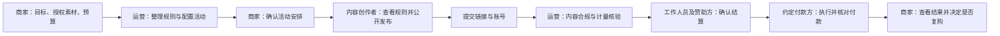
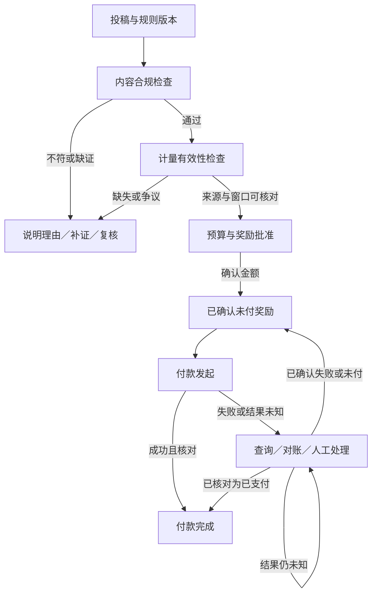
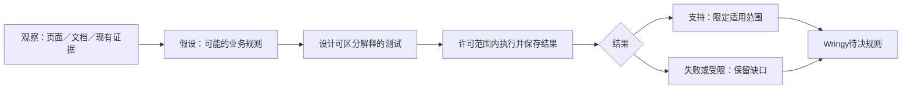

# Clipping与参考平台业务机制研究

## 1. 主要发现与证据边界

Clipping公开资料描述的生意是商家委托运营团队组织内容传播，内容创作者在自己的社交账号发布并提交链接，平台追踪和复核表现，再经工作人员与赞助方批准结算。软件承载活动、投稿、数据和付款记录，但“全托管”还包含招募、规则解释、人工判断和客户沟通。复制界面不能替代这些履约工作。[1](https://clipping.net/brands)[2](https://clipping.net/docs/clippers/payments)

本研究最重要的区分是四个判断：内容是否符合活动要求、观看数据是否可以计奖、奖励金额是否已批准、钱是否已支付完成。它们可以处于不同状态。内容通过但数据缺失，或奖励已批准但付款失败，都不应该被压缩成一个“通过／失败”。这是用于Wringy讨论的分析框架，不是已验证的Clipping内部数据模型。

**登录应用研究尚未完成。** 已观察入门首屏，以及当前clipper账号点击Dashboard／Client Access后返回入门页。没有进入真实活动、投稿、审核队列或支付流程，未接受条款、保存资料、提交表单或执行交易。公开商家页和FAQ、公开Rules八项展开内容已观察；公开营销仪表板不属于登录后台实测。[3](#source-3)

Clipping服务条款第4节明确涉及自动化工具、逆向工程／反编译和竞争分析限制。认证探索因此暂停。这里记录实际访问边界，不判断合同是否成立或作法律结论。本报告只整理已取得资料与可见行为，不声称逆向出私有后端，也不提供绕过限制的探测方法。[4](https://clipping.net/policies/terms-of-service)

|证据类型|本报告可以说明|不能据此声称|
|---|---|---|
|官方文档／条款|平台公开规定或描述的行为|实际后台始终按此执行|
|公开营销／FAQ|销售主张、展示结构及报价对象|审计业绩、风控准确率或完整收费|
|直接页面观察|指定账号、时间下可见内容与正常导航结果|其他角色权限、交易成功或后台架构|
|分析与Wringy提案|待验证假设、候选规则和决策依赖|已批准PRD、已获平台许可或研发交付保证|

研究日期为2026-09-13。Wringy沿用Content Rewards首发、商家／内容创作者／运营三角色、English／Bahasa Melayu／简体中文、RM50,000研发上限及2–4个月验证目标。所有后续选择均为提案。演示稿已获接受，不等于实施规则和全部预算已批准。

<!--pagebreak-->
## 2. 商家买什么，如何进入服务

商家购买的是有目标、有规则和预算的创作者内容分发。Clipping公开Brands页面强调创作者在原生平台发布、按经核验观看而非按帖计费，并由团队配置与运行活动。采购价值不应被简化成上传素材的工具，也不能从“核验观看”推成必然销售、特定国家真人触达或投资回报。[1](https://clipping.net/brands)[5](https://clipping.net/brands)

合作联系表收集姓名、推广对象、相关链接、素材类型、时间安排和预算，显示最低US$5,000，要求企业邮箱，不接受Gmail、Yahoo等个人邮箱。已直接读取表单，没有填写或提交；服务器实际校验未测试。这是该公开合作入口的门槛，不是全部合同的统一下限、平台佣金，也不能照搬为Wringy马来西亚小额试点报价。[6](https://clipping.net/contact?type=partnership)

图1　公开页面展示活动指标、曲线、预算和片段。图片不含账号身份资料；图中金额、观看量、客户标识均为平台营销展示，不作为真实商家后台、已核验账目或Wringy经营证据。[1](https://clipping.net/brands)

公开品牌页说没有自助配置，Enterprise又称客户成员可发起、审阅并查看分析。可能存在委托申请与实际上线的差别，或不同客户权限，但现有证据不能确定。报告采用“收集简报、由团队配置、商家确认”的公开服务描述，不补造自动开户、自动报价或所有客户可独立上线的流程。[1](https://clipping.net/brands)[7](https://clipping.net/enterprise)

**Wringy提案：** 创办人可以先人工解释活动、收集素材及预算，再把确认后的规则放入统一记录。首批商家细分、愿付价格和投放频率仍需实测。托管服务可以减少商家操作负担，但新增人工成本，应与复购一起观察。

<!--pagebreak-->
## 3. 三方怎样完成一场活动

下图是按公开业务说明整理的三方协作，不是Clipping私有后台流程复刻。工作人员与赞助方批准结算有文档依据，具体授权顺序、超时规则和付款责任边界仍有缺口。[1](https://clipping.net/brands)[2](https://clipping.net/docs/clippers/payments)[8](https://clipping.net/policies/clipper-terms-and-conditions)

图2　三角色活动流程。箭头表示业务依赖，不证明即时自动执行。每个跨角色交接都需要记录谁作决定、依据哪版规则以及时间。

|参与方|公开可支持的职责|Wringy需另行决定|
|---|---|---|
|商家／赞助方|给目标、素材和预算，参与方案与结算批准|素材担保、反对期限、付款责任及取消处理|
|运营团队|配置、招募、运行、复核、付款协调|谁可改规则／奖励，何时需第二人确认|
|内容创作者|绑定账号，在外部平台发帖后提交链接|参与资格、投稿权利、补证与收款要求|
|外部平台与付款服务|提供数据或执行支付|准入、数据延迟、交易失败与对账安排|

普通活动通常通过首次投稿加入，私有活动需批准后才显示完整规则及投稿入口。账号文档描述五位资料代码验证，至少一个Verified账号才可投稿。代码验证只能证明当时能够控制资料页，不自动证明素材版权、银行收款人身份、分析数据权限或观看真实性。[9](https://clipping.net/docs/clippers/campaigns)[10](https://clipping.net/docs/clippers/accounts)

提交可能因重复URL、账号不符、发布时间限制或缺少指定声音而失败；普通投稿与赏金投稿为二选一。跨账号、跨活动或相似剪辑的重复判断，以及错误的精确时间边界未公开。[11](https://clipping.net/docs/clippers/campaign-detail)

**Wringy提案：** 首版可由运营协助配置，但活动确认、规则版本、投稿证据和金额调整应留记录。队长和多层代理并非完成三方活动所必需，不能因竞品有入口便自动纳入Beta。

<!--pagebreak-->
## 4. 内容规则、权利与申诉

公开Rules八个折叠项已全部展开读取。它们是平台公布的内容要求，不是已验证的自动检测能力。英文受众比例属于规则示例；“明显自动化、低投入内容”也不能扩大为所有AI辅助内容一律禁止。[12](https://clipping.net/docs/clippers/rules)[13](https://clipping.net/docs/clippers/rules)

|公开规则类别|实际展开内容的含义|不能过度推断|
|---|---|---|
|虚假互动|包括购买观看、机器人粉丝、互换观看、自动点赞|增长峰值本身证明作弊|
|受众|列英语国家受众至少50%的例子|等于马来西亚逐帖观看规则|
|活动条件|错误声音／创作者、缺商家提及、偏离主题会违规|全站同一内容模板|
|指标可见|需保留可查看的表现指标|任意公开指标可经API合法取得|
|质量|低投入、明显自动化内容可能被移除|通用AI创作禁令或固定质量分数|
|重复内容|同一账号重复相同内容受限制|完整跨账号相似度算法已知|
|公开保留|收款前保持内容公开|到账后拥有无限授权或平台删帖无例外|
|工作人员决定|工作人员有移除投稿的权力|不存在申诉或必须自动拒付|

AUP允许处罚后30天内提交附证据的申诉。30天是申请窗口，不是30天结案或返款保证。Clipper条款又称工作人员决定为最终决定，两者程序衔接、复核人及改判补发机制仍不清楚。不能沿用旧研究“没有找到明确申诉期限”的总判断，也不能保证所有付款争议适用此窗口。[14](https://clipping.net/policies/acceptable-use-policy)[8](https://clipping.net/policies/clipper-terms-and-conditions)

素材授权需要独立检查。商家提供视频不意味着音乐、肖像、商标、剪辑、跨平台分发、后续广告再利用都已获许可。一般条款保留创作者内容所有权并授予平台处理许可，AUP要求权利与广告披露，但未补齐具体商家素材转授权链。[4](https://clipping.net/policies/terms-of-service)[14](https://clipping.net/policies/acceptable-use-policy)

**Wringy提案：** 活动简报逐项列可用素材、允许修改、发布平台、语言及使用期限；创作者接受时保存版本。拒绝或暂缓须说明具体不符项和补证路径。是否采用30天申诉窗口需另外选择，不直接移植竞争平台条款。

<!--pagebreak-->
## 5. 计酬单位与七个不同时间

Clipping文档描述固定观看费率及按观看份额分奖池两类方式。常见单帖门槛1,000、个人活动累计通常25,000，但活动规则优先；YouTube文档另使用engaged views。门槛不是通用费率，也不能自行推定只支付超出门槛部分。[15](https://clipping.net/docs/clippers/introduction)

|时点|公开描述|关键未知|
|---|---|---|
|发布|先在绑定社交账号公开发布|时间以平台记录还是抓取记录为准|
|提交|提交后开始追踪，存在age cutoff|提交前观看是否含入首次基线|
|采样|Welcome写每12小时刷新|实际延迟、失败补采与指标回落|
|活动结束／暂停|有固定期限、暂停和预算耗尽状态|已收稿尾部增长、暂停是否延长窗口|
|周期关闭|由赞助方关闭付款周期|固定时限、新旧周期归属与结转|
|奖励批准|工作人员及赞助方批准金额|反对、补证与批准的最长期限|
|支付与到账|按关闭周期时的资料批量处理|发送、服务方成功及实际到账时限|

文档“12小时”、营销“live／每日更新”不是同一层次的服务保证。可能分别描述采样、报告展示或宣传，但执行尚未实测。不能把此研究覆盖增加写成同一天发生了产品更新。[15](https://clipping.net/docs/clippers/introduction)[1](https://clipping.net/brands)[8](https://clipping.net/policies/clipper-terms-and-conditions)

Dashboard中的Past还可能包括活动仍在运行、但本人本周期未投稿的活动。因此Past、活动结束、周期关闭与已付款必须分开理解。[16](https://clipping.net/docs/clippers/dashboard-home)

**Wringy提案：** 计奖规则先指定原始指标名称、来源平台、时间窗、时区、基线、合格条件及舍入规则，再决定界面显示。若每1,000次合格观看奖励RM5，应明确“合格观看”如何从可取得的数据得出，不能仅靠一个累计数字反推活动期间表现。

迟到投稿、延迟数据和数据修正要有事先约定的处理。没有可核对基线时，不能凭最后一份lifetime总数猜测某段时间新增观看；技术上能做减法也不证明平台允许该数据用途。[17](https://developers.google.com/youtube/terms/developer-policies)

<!--pagebreak-->
## 6. 内容、计量、奖励与付款分开判断

Clips文档使用Tracking／Stopped／Banned主状态，Paid／Bounty为叠加标签；Payments仍要求最终审批。Tracking不等于无条件应付，Paid界面标签也不是银行到账凭证。[18](https://clipping.net/docs/clippers/clips)[2](https://clipping.net/docs/clippers/payments)

图3　Wringy候选判断流程，未冻结。恢复到待处理义务不代表允许盲目重新打款；结果未知必须先核对原交易。实际状态模型与异常转换需在PRD及支付方案中另行确认。

|检查|应回答的问题|最少保留的依据|
|---|---|---|
|内容合规|内容、授权及披露是否符合加入时规则|规则版本、稿件记录、不符项与审核人|
|计量有效性|账号、作品、字段、时间及资格是否可核对|原始来源、时间戳、缺失与修正原因|
|奖励批准|金额、门槛、上限及预算分配是否成立|计算说明、批准／调整记录、关联预算|
|付款完成|这笔已确认奖励是否真正完成支付|付款责任方、交易标识、回执与对账结果|

四个维度不应共用一个状态字段。例如内容通过但授权失效，应该说明“数据待恢复”；支付服务超时不应该把奖励取消或把状态误标为成功。为了方便操作而合并这些判断，会掩盖究竟是谁、在哪个环节需要处理问题。

这是基于公开机制缺口提出的Wringy可解释性方案。公开资料不足以证明Clipping具有相同账本、独立复核或自动恢复机制，也不能由图中节点数量估算开发成本。

<!--pagebreak-->
## 7. 奖励资金、团队佣金与净额

Clipping付款文档列可新增PayPal、Ethereum主网USDC／USDT，每活动固定一种；其他旧方式作为历史兼容显示。周期关闭后经工作人员和赞助方批准批量处理，没有据此证明按需提前提现、固定到账日或马来西亚完整支持。[2](https://clipping.net/docs/clippers/payments)[8](https://clipping.net/policies/clipper-terms-and-conditions)

Teams文档规定队长佣金5%–10%，默认5%，调整作用于后续付款周期。成员页面不显示费率，建议向队长询问或付款后查毛额、扣佣和净额。这里是队长佣金百分比，不是团队人数，也不是Clipping向商家收取的平台费。[19](https://clipping.net/docs/clippers/teams)

推荐链接在打开后7天内注册可能自动归队，退出与成员变更需支持或队长协调。队长能收佣金不能推导其可审稿、批准付款或承担侵权责任。Wringy若考虑类似招募，须先确认佣金可见、同意与退出后的周期处理，不能只复制增长入口。[19](https://clipping.net/docs/clippers/teams)

|金额对象|必须分清|当前Clipping证据边界|
|---|---|---|
|商家活动预算|奖励资金、服务费、税及处理费是否包含|未取得统一完整收费表|
|创作者毛奖励|普通奖励、赏金、门槛与封顶|金额在最终复核前可能只是估计|
|创作者净额|毛额减队长佣金与适用费用|处理费可能适用，全部净额规则不完整|
|平台收入|平台自己的服务收入|不能从每观看报价反推抽成或利润|

Wringy演示中的15%是独立收费提案。已确认奖励RM2,000产生服务费RM300，不表示商家所有RM2,300都流入Wringy，也不表示团队抽成应从中再扣。沿用原提案，奖励由商家直接支付或经确认的外部服务处理；研究不因此改成自建钱包、平台托管或默认垫资。

**Wringy提案：** 首次试点选清一种付款责任和可用方法，以一笔真实可核对交易证明路径。平台展示、收款资料、付款指令和银行／服务方结果要能对应。竞品列出某支付方式不证明Wringy主体及马来西亚用户自动获得准入。

<!--pagebreak-->
## 8. 预算耗尽、失败付款与退款

“商家绝不超预算”与“每条稿按标价付足”可能冲突。假设活动只剩RM100，两稿在延迟采样后各对应RM80，至少有RM60无法由剩余预算支付。应在活动开始前决定排序、预留、比例分配或补资规则；公开硬上限不能代替这项选择。[20](https://clipping.net/campaigns)[9](https://clipping.net/docs/clippers/campaigns)

以下为Wringy讨论用例，不是竞品后台已验证实现。

|例外情况|容易误写的处理|应先确认的规则|
|---|---|---|
|并发稿件触及上限|两稿都按旧余额批准|预算占用时点、分配顺序、迟到数据|
|稿件私密／删除|一律当作零观看或立即罚款|不可读原因、恢复条件、已确认金额处理|
|付款服务超时|直接再付一次|原交易查询、业务唯一标识、结果未知状态|
|某笔付款失败|取消创作者应付款|失败原因、补正资料、何时允许重发|
|商家取消|把全部可见余额退回|未决稿件、已确认未付、服务费及退款次序|
|付款后发现争议|覆盖原历史金额|独立调整、证据、通知与申诉记录|

Clipping公开允许取消，但未取得可执行的完整商家退款公式；不能写成“未用预算必全退”或“绝不退款”。它的全托管运营也不证明资金托管于独立账户。付款文档对错误或失去访问权账户、链上不可逆作出警示，但没有覆盖全部服务商超时、退回、冻结及分批失败情形。[2](https://clipping.net/docs/clippers/payments)[4](https://clipping.net/policies/terms-of-service)

公开资料中仍需并列保留的张力包括：AUP30天申诉窗口与工作人员最终决定；12小时刷新与每日／实时宣传；旧博客0%–10%团队费与当前Teams5%–10%；旧支付方式与当前可新增方式。它们是文字范围或版本差异，不是后台漏洞证据。[14](https://clipping.net/policies/acceptable-use-policy)[19](https://clipping.net/docs/clippers/teams)[15](https://clipping.net/docs/clippers/introduction)[8](https://clipping.net/policies/clipper-terms-and-conditions)

**Wringy提案：** 用离线预算模型先检查重复批准、并发越界和付款超时；用获准沙盒核对交易结果。任何钱包、资金保管、退款责任或代付安排都需另行决定，不能通过一个“余额”标签默认为已解决。

<!--pagebreak-->
## 9. 参考平台提供不同的结算答案

比较的重点是购买、审核与付款责任，而不是平台声称的创作者总数或观看规模。Content Rewards当前独立产品、Whop旧内嵌活动及Whop自有Program需分别识别合同，不合并成单一版本。[21](https://contentrewards.com/brands-terms)[22](https://whop.com/content-rewards-terms-of-service/)

|参照|已公开的关键安排|对Wringy的意义与限制|
|---|---|---|
|Content Rewards|当前商家标准10%、认证8%；CPM创作者费10%。批准后计奖7天，再持有3天转Whop余额|窗口、奖励及支付余额分开；不是第10天银行到账保证，也不能把不同费基简单相加|
|Vyro|预算接近耗尽时按比例分配，收益可能低于标示CPM。合同允许客户资金未结清时取消不付|必须公开预算冲突和资金条件；不是本次观察到实际欠付|
|Clipster|宣传策略、招募、审核、付款与报告托管；品牌合同另划审核责任|营销服务范围不等于合同义务。音乐语言限制不可套入BM活动|
|Clip.farm|官网索引描述固定池按观看份额分配，80／20与100%预算分配文字冲突|固定池不同于固定CPM。统一分成与实际账单尚未确认|
|MakeClout／Clouted|只有Accepted投稿可支付，私密账号、坏链接、地区限制影响追踪|应解释不可计量原因；一般网站与应用剪辑条款不能混用|

以上分别依据创作者／商家定价、条款、帮助及官方页面；未进行这些平台的交易实测。[23](https://contentrewards.com/pricing/creators)[24](https://contentrewards.com/pricing)[25](https://vyro.com/help/earnings-and-payments/why-arent-my-earnings-matching-the-cpm-on-the-campaign)[26](https://vyro.com/clipper-terms)[27](https://advertise.clipster.gg/)[28](https://www.clipster.gg/general-campaign-rules)[29](https://www.clipster.gg/brand-tou)[30](https://clip.farm/)[31](https://app.clouted.com/terms-of-service)

Content Rewards还区分风险标记申诉与普通商家拒稿复核。风险申诉每稿一次，目标10个工作日回复，不保证普通拒稿翻案。暂停活动并不取消已批准稿结算，退款需先处理待审与既有应付款。这些安排适合用来提出Wringy问题，不应直接移植为获批规则。[21](https://contentrewards.com/brands-terms)[32](https://contentrewards.com/terms)

Clipfarm.ph仅为较低置信度本地支付补充：官方索引有本币、商家外加费与每周出款，但直读超时、经营成熟度和实际付款未核验。Socialplug所读官网没有建立活动投稿奖励闭环，故不列直接参照。两项都不作为Wringy定价或马来西亚准入依据。[33](https://clipfarm.ph/pricing)[34](https://www.socialplug.io/)

**Wringy提案：** 先选择一种易解释的合格观看奖励模型。固定池、周期合作、队长佣金、复杂组织权限和AI创作工具各增加不同规则与成本，不因竞争者提供便纳入同一首版。

<!--pagebreak-->
## 10. 能取得哪些观看数据

API是平台提供的软件取数入口，OAuth是账号主人在平台上授权连接的方式。账号主人授权数据与任意公开视频数据是两条路径；“网页可见”不能推导“可自动抓取”，字段存在也不证明Wringy已取得应用审核或奖励用途许可。[35](https://developers.tiktok.com/docs/en/tiktok-api-v2-video-query)[36](https://developers.google.com/youtube/v3/getting-started)[37](https://developers.google.com/youtube/analytics/reference/reports/query)

|路径|已核文档支持|地区及准入限制|
|---|---|---|
|TikTok所有者授权Display API|video.list／query可查询授权用户视频，含view_count|普通字段未见逐帖观看国家；不能承诺MY观看，仍需外部账号授权与应用审核|
|TikTok任意公开视频|上述query不是任意视频查询器|Research不适合商业关键路径；Business特殊产品另待确认|
|Instagram专业账号授权|Business／Creator路线成立，Facebook Login与Instagram Login前提不同|现行逐媒体Insights字段全文未完整取得；账号受众地区不等于单帖地区观看|
|YouTube公开统计|viewCount及channelId有公开Data API文档支持|只能识别发布频道，不能证明提交者控制；无等价公开逐帖国家观看|
|YouTube所有者Analytics|授权频道可按video过滤并研究country维度|MY行可能受低量缺失与隐私限制，ZZ为未知；非完整、实时或真人证明|

这些边界分别来自官方接口、审核、分析维度与有限数据说明；未执行Wringy社交授权、API调用或平台应用审核。[35](https://developers.tiktok.com/docs/en/tiktok-api-v2-video-query)[38](https://developers.tiktok.com/docs/en/tiktok-api-v2-video-object)[39](https://developers.tiktok.com/docs/en/app-review-guidelines)[40](https://developers.tiktok.com/docs/en/research-api-faq)[41](https://www.postman.com/meta/instagram/folder/u4g5a2a/instagram-api-with-facebook-login)[42](https://developers.facebook.com/docs/instagram-platform/api-reference/instagram-user/insights/)[43](https://developers.facebook.com/docs/instagram-platform/instagram-api-with-facebook-login/business-discovery/)[44](https://developers.google.com/youtube/v3/docs/videos)[45](https://developers.google.com/youtube/analytics/channel_reports)[46](https://developers.google.com/youtube/analytics/dimensions)[47](https://support.google.com/youtube/answer/9101241)

不能用创作者住址、MY手机号、马来西亚粉丝占比或内容语言代替逐帖观看地区。假设某账号60%粉丝来自马来西亚，某帖10,000观看，乘出6,000“MY核验观看”没有证据基础。country字段本身也不证明国籍或真人身份。

YouTube禁止奖励观众观看、点赞、订阅等互动，但这不能自动推出禁止按作品表现向创作者付费。实际参与者、奖励触发与数据用途须另核适用范围；报告既不宣布许可已获批准，也不作禁止创作者报酬的法律结论。[17](https://developers.google.com/youtube/terms/developer-policies)

**Wringy提案：** 如果只能取得全球观看，在商家明确接受、用途许可核实的前提下，研究窄范围全球合格观看活动。不能假装已有MY核验，也不默认退回历史按帖UGC业务。

<!--pagebreak-->
## 11. 数据失败与证据质量

数据链需要保留平台与版本、稳定账号及作品ID、字段原名、计量单位、报告起止时间、平台时区、最近成功读取及数据截止时间。刚取到数据不等于平台刚更新；同一数字若时间窗或口径不同，不能直接比较。[37](https://developers.google.com/youtube/analytics/reference/reports/query)[46](https://developers.google.com/youtube/analytics/dimensions)

|观察|可以得出的结论|不该自动执行|
|---|---|---|
|明确返回0|该字段在指定窗口返回零|与权限缺失混为一谈|
|字段缺失／被隐私抑制|当前无法取得该项|猜成零或按粉丝比例补齐|
|授权撤回／权限不足|停止使用失效权限，说明旧值时间|无限重试或改用未经许可抓取|
|配额或服务故障|数据延迟，列出失败范围|换账号绕限制或认定创作者作弊|
|统计回落／内容不可见|来源修正或不可读，需要复核|静默扣回已付款或覆盖历史|
|结算日数据仍不齐|按事先规则暂缓或补证|临时换数据源改变计奖口径|

YouTube Analytics受平台报告时区、可用指标截止日及低量隐私限制影响。TikTok Research的更新说明不能挪作普通Display API延迟承诺。公开文档存在并不解决Wringy的实际配额、应用审核或地区字段可用性。[37](https://developers.google.com/youtube/analytics/reference/reports/query)[46](https://developers.google.com/youtube/analytics/dimensions)[47](https://support.google.com/youtube/answer/9101241)[40](https://developers.tiktok.com/docs/en/research-api-faq)

手动让创作者展示官方分析可以作为较低强度补证，但截图可能不完整，也不能代替平台许可、作品归属和可重复对账。第三方数据服务需说明授权链、覆盖字段、存储要求和报价，不以采购掩盖数据来源。

**Wringy提案：** 分开业务付款记录与受平台政策约束的社交数据，确定必要保存期限、撤权及删除处理。不能因“要审计”就永久保存全部数据，也不能靠哈希或截图规避删除要求。YouTube的数据刷新、复核及删除政策应按实际授权路径核对；马来西亚隐私适用另行评估。[17](https://developers.google.com/youtube/terms/developer-policies)

反作弊调查需要多个依据和可解释的判断。突增、低互动或异常地区可以触发复核，不能单独证明买量。没有受控样本、正确标签和误判统计，就不能宣称检测准确率或“100%真实观看”。

<!--pagebreak-->
## 12. 从可观察行为到可验证规则

业务机制研究先整理来源和可见结果，再提出可以被反驳的假设。它不要求知道私有代码，更不豁免平台条款。Clipping认证探索已暂停；后续试验仅针对许可范围内的数据授权、Wringy自有离线模型及获授权支付沙盒。[4](https://clipping.net/policies/terms-of-service)

图4　观察、假设、测试与PRD决策。图中步骤是研究方法，不是已经完成的验证。

|问题|可区分的验证|未通过时怎样处理|
|---|---|---|
|提交者是否控制作品|自愿授权账号与本人作品稳定ID匹配|不标已验证归属，补证或停止该路径|
|外部MY账号能否接入|至少覆盖非应用管理员的授权与字段返回|只限内部测试不能称商业准入完成|
|MY观看是否可得|同作品、同窗口的country报告与缺行记录|缺字段／缺行保持未知，不用代理变量补数|
|预算是否被重复占用|离线模型交换并发顺序、重复事件|不满足守恒则不能作为实现验收依据|
|付款超时会否重付|授权沙盒核对原交易、迟到通知与退回|结果未知先查询，不盲目重新付款|

上述均为未执行的Wringy试验提案。样本数量和观察窗口应随实际授权及成本确定，不构成逐周排期，也不用于推导市场代表性或反作弊准确率。每项结果记录为通过、失败、受限或未执行，并附原始依据和对产品承诺的影响。

复现记录应包含来源URL、账号角色、观察时间和时区、前置状态、单一正常动作、结果与另一种解释。空白页面不证明功能不存在，隐藏按钮不证明服务端权限正确，营销动图不证明数据实时更新。

<!--pagebreak-->
## 13. Wringy PRD待决事项：计量与交易

以下是待讨论的业务选择，全部尚未冻结。研究提供问题及证据需求，不以竞品做法替代商家接受、服务商准入或研发报价。

|必须决定|候选提案与边界|冻结前需要什么|
|---|---|---|
|计酬单位与合格观看时钟|明确原始字段、单稿／累计门槛、基线、起止、时区及舍入|真实数据样本，恰好达标／晚提交算例|
|来源平台|先讨论一个具可用授权与字段的平台，不承诺任意公开视频|外部账号、用途、字段及配额验证|
|素材所有权／IP|商家许可与创作者发布授权分开，写明再利用与撤销|实际素材授权文件和责任确认|
|地域|有同粒度数据才承诺MY观看；否则需商家接受全球口径|country粒度、隐私缺行与用途证据|
|并发稿件与预算上限|预留、排序或比例方案先选清，不能事后秘密折算|两稿越界、迟到数据、补资算例|
|规则版本|创作者加入时保存版本，变更明确适用范围|变更通知与既有投稿处置选择|
|私密帖／API中断|不可读与零分开，规定补证、恢复和最终截账|真实故障样本或许可沙盒记录|

这些问题由Clipping投稿、计量、账号与付款文档，以及社交数据权限差异共同提出。公开资料没有给出Wringy可直接照搬的MY可用方案。[11](https://clipping.net/docs/clippers/campaign-detail)[10](https://clipping.net/docs/clippers/accounts)[8](https://clipping.net/policies/clipper-terms-and-conditions)[35](https://developers.tiktok.com/docs/en/tiktok-api-v2-video-query)[45](https://developers.google.com/youtube/analytics/channel_reports)

**决策例子。** 商家以为购买马来西亚受众，但系统只能提供全球累计播放，即使计算准确，也没有完成同一项交易。应先让商家接受可提供的口径，或暂停地区承诺，而不是在报告中把全球数据换个名字。相反，商家明确接受全球合格观看后，仍需定义作弊、资格、时间及预算处理，不能把“全球”理解为所有播放无条件计奖。

阶段内保留Content Rewards方向，后续商家网店和创作者工具属于另行验证的长期设想，不因本次机制研究自动进入50k首版范围。

<!--pagebreak-->
## 14. Wringy PRD待决事项：复核与付款责任

|必须决定|候选提案与边界|冻结前需要什么|
|---|---|---|
|暂缓原因与申诉期限|原因可解释，分内容／计量／预算／付款；窗口与回复目标分别定|责任人、补证要求、复核与改判流程|
|周期关闭与退款|先处理未决及已确认奖励，再计算可退部分；不默认资金托管|商家合同、奖励义务、服务费及退款算例|
|付款责任与方式|商家直接付款或经确认服务处理，不自动新增自建钱包|主体准入、币种、费用、失败和真实回执|
|证据与审计|规则版本、采样依据、调整、批准与付款互相关联|保存期限、访问权限、撤权和删除安排|
|商家角色|确认目标／预算／规则，查看相关结果与责任|能否取消、反对及更改，权限验收|
|内容创作者角色|查看规则、提交本人内容、补证、查询奖励与付款|身份与作品控制、收款资料权限|
|运营角色|协助配置、审核、解释异常、协调结算|谁可改金额、是否需要复核、敏感资料边界|
|语言偏好|EN／BM／简体中文偏好保存，规则语义一致|术语、版本同步与关键金额文字核对|

Clipping的30天申诉窗口、周期关闭及付款条件是参照；Content Rewards的人工审核、退款前处理应付款是另一参照。Wringy仍需选择自己的期限和责任，不能将两套合同拼接后称已批准制度。[14](https://clipping.net/policies/acceptable-use-policy)[2](https://clipping.net/docs/clippers/payments)[21](https://contentrewards.com/brands-terms)[32](https://contentrewards.com/terms)

界面语言不改变计奖规则。若同一活动的BM和中文版本在“观看起算”或“公开保留到何时”不同，翻译问题会变成交易争议。因此语言偏好和规则版本要同时处理，不能只在上线前翻译按钮。

对付款的最低解释要求是：谁欠谁哪一笔钱、基于何种规则、哪个金额已确认、由谁执行、哪个回执证明结果。运营可以人工协助，但“人工处理”不能成为缺少依据、无限延期或重复付款的理由。

<!--pagebreak-->
## 15. 2–4个月目标下的可行性门槛

RM50,000是既有研发上限，不是复制所有参考平台功能的报价。正式供应商范围、外部服务报价、应用审核等待与真实处理成本尚未核实。

|阶段|进入下一步所需条件|条件不足时|
|---|---|---|
|发现|商家接受明确计奖口径；至少一条真实数据及付款路径可验证；关键规则有候选答案|保留缺口，缩小覆盖或暂停不可能兑现的承诺|
|建设|范围、权限、规则版本、异常处理与验收要求明确；Belcort报价能与50k约束核对|调整范围后再确认，不用未经报价数字证明可行|
|付费试点|Beta验收、素材许可、数据权限、奖励责任及付款路径就绪|不能将演示或内部账号成功等同商业可用|
|后续扩张讨论|实际商家付费、活动履约、创作者按约获奖与商家复购；服务成本和运营容量可解释|不自动进入营销融资，不把情景商家数当既有客户|

人工可协助需求整理、审核、补证及对账，但不一定降低全部成本。试点应记录单场投稿量、处理时间、数据失败、申诉、支付费用和复购原因，用实际结果修正范围。2–4个月是研发与付费试点验证目标，不是三平台全自动、完整反作弊或地区真人核验保证。

尚未完成的关键验证包括：Clipping完整认证应用；三平台对Wringy外部MY账号的授权与用途许可；Instagram当前字段完整性；平台服务费和付款条款；真实数据异常、付款失败及到账测试；Wringy商家愿付价格与连续复购。资料覆盖充分不等于这些依赖已通过。

本报告可以交给产品与开发人员讨论规则及试验，不能直接作为实施规格。下一份PRD应引用已确认的决策、负责人及验收依据；仍未知的字段、权限、费用和期限继续标明，不用页面设计填补证据空白。

<!--pagebreak-->
## 来源

以下按正文首次引用编号。访问日期均为2026-09-13；无公开发布日期记为未标日期。官方陈述不等于履约实测。底层报告分别见[公开机制审计](public/mechanism-audit.md)、[竞品比较](comparators/competitors.md)及[数据与研究方法](methodology/methodology-and-data.md)，保留更完整的查询、失败与冲突记录。

1. CLIPPING / Clipping.net，[For Brands](https://clipping.net/brands)。未标日期。访问：2026-09-13。

2. CLIPPING / Clipping.net，[Payments](https://clipping.net/docs/clippers/payments)。未标日期。访问：2026-09-13。

3. Clipping公开页面及本地直接观察记录，Clipping浏览器观察与访问边界（本地认证边界记录，无公开链接）。未标日期。访问：2026-09-13。

4. CLIPPING / Clipping.net，[Terms of Service](https://clipping.net/policies/terms-of-service)。发布／更新：2026-01-01。访问：2026-09-13。

5. Clipping公开页面及本地直接观察记录，[Clipping Brands受众与FAQ展开记录](https://clipping.net/brands)。未标日期。访问：2026-09-13。

6. CLIPPING / Clipping.net，[Partnership contact entry](https://clipping.net/contact?type=partnership)。未标日期。访问：2026-09-13。

7. CLIPPING / Clipping.net，[Enterprise](https://clipping.net/enterprise)。未标日期。访问：2026-09-13。

8. CLIPPING / Clipping.net，[Clipper Terms & Conditions](https://clipping.net/policies/clipper-terms-and-conditions)。发布／更新：2026-05-27。访问：2026-09-13。

9. CLIPPING / Clipping.net，[Campaigns documentation](https://clipping.net/docs/clippers/campaigns)。未标日期。访问：2026-09-13。

10. CLIPPING / Clipping.net，[Accounts](https://clipping.net/docs/clippers/accounts)。未标日期。访问：2026-09-13。

11. CLIPPING / Clipping.net，[Submit](https://clipping.net/docs/clippers/campaign-detail)。未标日期。访问：2026-09-13。

12. CLIPPING / Clipping.net，[Rules](https://clipping.net/docs/clippers/rules)。未标日期。访问：2026-09-13。

13. Clipping公开页面及本地直接观察记录，[Clipping公开Rules八项展开记录](https://clipping.net/docs/clippers/rules)。未标日期。访问：2026-09-13。

14. CLIPPING / Clipping.net，[Acceptable Use Policy](https://clipping.net/policies/acceptable-use-policy)。发布／更新：2026-01-01。访问：2026-09-13。

15. CLIPPING / Clipping.net，[Welcome](https://clipping.net/docs/clippers/introduction)。未标日期。访问：2026-09-13。

16. CLIPPING / Clipping.net，[Dashboard](https://clipping.net/docs/clippers/dashboard-home)。未标日期。访问：2026-09-13。

17. Google / YouTube，[YouTube API Services Developer Policies](https://developers.google.com/youtube/terms/developer-policies)。未标日期。访问：2026-09-13。

18. CLIPPING / Clipping.net，[Clips](https://clipping.net/docs/clippers/clips)。未标日期。访问：2026-09-13。

19. CLIPPING / Clipping.net，[Teams](https://clipping.net/docs/clippers/teams)。未标日期。访问：2026-09-13。

20. CLIPPING / Clipping.net，[Run a Clipping Campaign](https://clipping.net/campaigns)。未标日期。访问：2026-09-13。

21. Content Rewards，[Organization Terms of Service](https://contentrewards.com/brands-terms)。发布／更新：2026-09-03。访问：2026-09-13。

22. Whop，[Content Rewards Terms of Service](https://whop.com/content-rewards-terms-of-service/)。未标日期。访问：2026-09-13。

23. Content Rewards，[Creator Pricing](https://contentrewards.com/pricing/creators)。未标日期。访问：2026-09-13。

24. Content Rewards，[Pricing](https://contentrewards.com/pricing)。未标日期。访问：2026-09-13。

25. Vyro，[Why aren’t my earnings matching the CPM on the campaign?](https://vyro.com/help/earnings-and-payments/why-arent-my-earnings-matching-the-cpm-on-the-campaign)。未标日期。访问：2026-09-13。

26. Vyro，[Clipper Terms & Conditions](https://vyro.com/clipper-terms)。发布／更新：2025-12-20。访问：2026-09-13。

27. Clipster.gg，[Built for Scale. Paid for Performance.](https://advertise.clipster.gg/)。未标日期。访问：2026-09-13。

28. Clipster.gg，[Content Rules](https://www.clipster.gg/general-campaign-rules)。未标日期。访问：2026-09-13。

29. Clipster.gg，[Brand Terms of Use](https://www.clipster.gg/brand-tou)。未标日期。访问：2026-09-13。

30. Clip.farm，[Gagne de l’argent en clippant](https://clip.farm/)。未标日期。访问：2026-09-13。

31. MakeClout / Clouted，[Clouted Terms of Service](https://app.clouted.com/terms-of-service)。发布／更新：2026-03-04。访问：2026-09-13。

32. Content Rewards，[Creator Terms of Service](https://contentrewards.com/terms)。未标日期。访问：2026-09-13。

33. Clipfarm.ph，[Pricing](https://clipfarm.ph/pricing)。未标日期。访问：2026-09-13。

34. Socialplug，[Buy Followers, Likes, Subscribers & Views](https://www.socialplug.io/)。未标日期。访问：2026-09-13。

35. TikTok，[TikTok Query Videos](https://developers.tiktok.com/docs/en/tiktok-api-v2-video-query)。未标日期。访问：2026-09-13。

36. Google / YouTube，[YouTube Data API overview](https://developers.google.com/youtube/v3/getting-started)。未标日期。访问：2026-09-13。

37. Google / YouTube，[YouTube Analytics Reports Query](https://developers.google.com/youtube/analytics/reference/reports/query)。未标日期。访问：2026-09-13。

38. TikTok，[TikTok Video Object](https://developers.tiktok.com/docs/en/tiktok-api-v2-video-object)。未标日期。访问：2026-09-13。

39. TikTok，[TikTok App Review Guidelines](https://developers.tiktok.com/docs/en/app-review-guidelines)。未标日期。访问：2026-09-13。

40. TikTok，[TikTok Research API FAQ](https://developers.tiktok.com/docs/en/research-api-faq)。未标日期。访问：2026-09-13。

41. Meta official Postman workspace，[Instagram API with Facebook Login](https://www.postman.com/meta/instagram/folder/u4g5a2a/instagram-api-with-facebook-login)。未标日期。访问：2026-09-13。

42. Meta，[Instagram User Insights reference](https://developers.facebook.com/docs/instagram-platform/api-reference/instagram-user/insights/)。未标日期。访问：2026-09-13。

43. Meta，[Instagram Business Discovery reference](https://developers.facebook.com/docs/instagram-platform/instagram-api-with-facebook-login/business-discovery/)。未标日期。访问：2026-09-13。

44. Google / YouTube，[YouTube Videos resource](https://developers.google.com/youtube/v3/docs/videos)。未标日期。访问：2026-09-13。

45. Google / YouTube，[YouTube Analytics Channel Reports](https://developers.google.com/youtube/analytics/channel_reports)。未标日期。访问：2026-09-13。

46. Google / YouTube，[YouTube Analytics Dimensions](https://developers.google.com/youtube/analytics/dimensions)。未标日期。访问：2026-09-13。

47. Google / YouTube，[Understand limited data in YouTube Analytics](https://support.google.com/youtube/answer/9101241)。未标日期。访问：2026-09-13。

