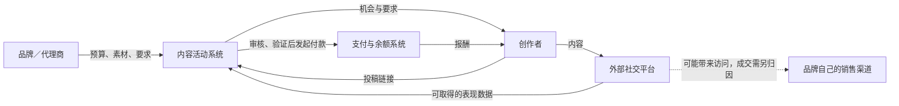

# Whop 商业模式与功能拆解
日期：2026-09-10 · 公开资料研究 v1

> 已有扩展版：[Whop 全业务地图与 12 板块研究包](whop-full/README.md)。本文件保留为第一轮聚焦研究，不能单独代表当前完整清单。

## 阅读结论

**分析结论：Whop 把经营业务、销售与交付、推广分发，以及收付款组合在一个生态中。你提到的「品牌＋creator」最直接对应 Content Rewards：品牌出任务和预算，创作者制作并传播内容，以符合规则的产出换取报酬。** 这个机制与创作者自己卖课、卖会员，以及按成交拿佣金的推广分别成立；不要把三者视为同一笔交易。[Whop 首页](https://whop.com/) · [Content Rewards 官方说明](https://docs.whop.com/memberships-and-access/third-party-apps/content-rewards) · [联盟推广](https://docs.whop.com/affiliates/be-an-affiliate)

这里先解释 Whop 与相关生态，不决定 wringy.com 应复制哪一部分。马来西亚首发保留为创始人已确认输入，卖家选择暂不推进。见[创始人输入](../founder-inputs.md)。

## 1. 先认清参与者与产品归属

| 参与者 | 提供什么 | 希望得到什么（分析） |
| --- | --- | --- |
| 商品或服务商家 | 产品、课程、社群、软件或服务及交付承诺 | 收入、客户关系、重复购买 |
| 发起活动的品牌／代理商 | 预算、素材、创作要求 | 内容资产和传播；是否带来销量需另验证 |
| 内容创作者／剪辑者 | 原创或再剪辑内容、自己的社交账号和传播工作 | 内容或表现报酬 |
| 联盟推广者 | 推荐链接、受众和销售线索 | 归因订单的佣金 |
| 消费者／成员 | 付款、时间和参与 | 产品价值、内容或访问权限 |
| Whop 与应用运营方 | 软件、发现入口、审核机制、支付与结算等分工 | 各自合同约定的服务收入 |

上述角色是分析分类，不是互斥账户类型。同一个人可以经营课程，也可以替另一品牌发视频。[账户与成员概念](https://docs.whop.com/developer/concepts) · [推广设置](https://docs.whop.com/affiliates/promote-your-business) · [内容奖励说明](https://docs.whop.com/memberships-and-access/third-party-apps/content-rewards)

**归属边界：** Whop 官网有自己的 Content Rewards Program 条款；同时，当前同名网页应用的 2026-09-03 条款把运营主体写为 Content Rewards Inc，并将 Whop 列为独立的支付和资金流转提供者。Whop 文档把该功能列在第三方应用栏目。不能把应用运营费全部记成 Whop 收入，也不能把不同合同拼成统一当前规则。现有证据不足以说明历史股权、出售或分拆关系。[Whop 条款](https://whop.com/content-rewards-terms-of-service/) · [应用组织条款](https://b4e0vdqv6zgqeqj4pfgm.apps.whop.com/brands-terms)

## 2. 三条业务链，触发收入的事件不同

| 业务链 | 谁付钱给谁 | 报酬由什么触发 | 功能核心 |
| --- | --- | --- | --- |
| 创作者经营自己的生意 | 消费者付给商家 | 购买产品或订阅 | 店铺、方案、结账、交付访问、客户管理 |
| 品牌雇用创作者传播 | 品牌预算支付创作者 | 合格内容、有效观看或约定周期交付，视产品／合同 | 活动市场、要求、投稿、审核、计量、结算 |
| 创作者帮助别人卖货 | 商家向推广者支付佣金 | 归因购买，并满足佣金结算条件 | 推广链接、佣金规则、订单归因、撤回和付款 |

来源：[产品管理](https://docs.whop.com/manage-your-business/products/manage-products) · [Content Rewards](https://contentrewards.com/) · [推广者规则](https://docs.whop.com/affiliates/be-an-affiliate)。

下面是机制示意，不是 Whop 的完整会计清算图：

**推断：** 平台不需要拥有 TikTok 或 YouTube 的全部流量，仍能组织创作者在这些渠道分发；但因此依赖社交平台的数据、账号和内容规则。曝光到成交的虚线并不是被证明的自动闭环。[数据获取说明](https://b4e0vdqv6zgqeqj4pfgm.apps.whop.com/privacy-policy)

## 3. 品牌＋creator 的工作方式

### 内容类型与报酬类型是两个维度

Clipping 是把现有素材剪成短内容；UGC 是创作者按要求制作原创品牌内容。二者说明「交付什么」。按千次观看、按篇、按周期合作说明「怎样算钱」；后三种是当前 Content Rewards 网页应用公开的计价方式，不能全部当成 Whop 每个内嵌活动都支持的功能。[Whop 说明](https://docs.whop.com/memberships-and-access/third-party-apps/content-rewards) · [应用创作者介绍](https://contentrewards.com/creators)

### 从品牌发起到创作者到账

1. **定义活动。** 品牌说明目标、素材、接受的平台、内容形式和判断标准。
2. **设置经济条件。** 决定预算与计价方式，必要时设置单条门槛或封顶，完成注资。
3. **分发机会。** 创作者浏览活动；当前应用提供公开、申请制与私密形式。
4. **制作与发布。** 使用品牌素材剪辑或创作原创内容，发布到相应社交账户。
5. **提交与审核。** 提交链接，检查内容是否符合已公布要求；当前应用也有可选的发布前草稿审核。
6. **验证与计酬。** 检查表现和异常，按活动适用的计价、窗口、上限和预算计算。
7. **结算与提现。** 已获批、待验证、可用余额、银行到账是不同状态。
8. **续投或结束。** 处理剩余预算、待审稿件、已批准付款，以及内容后续使用。

这是跨资料归纳的业务骨架，不声称有一份适用于所有版本的操作规范。具体字段、审核状态与证据见[品牌与创作者证据报告](whop-brand-creator.md)；规则来源为[Whop 设置教程](https://whop.com/blog/set-up-content-rewards/)、[当前应用主页](https://contentrewards.com/)及[创作者条款](https://b4e0vdqv6zgqeqj4pfgm.apps.whop.com/terms)。

### 四个容易误判的细节

- **最低报酬不是保底工资。** Whop 文档中的最低值可以是投稿进入审核的门槛；未达标的作品未必获得报酬。
- **总观看量不等于付费观看量。** 合格性、窗口、上限和预算会改变计酬结果。
- **审核通过不等于银行到账。** 还可能需要验证、等待结算与提现处理。
- **购买曝光不等于购买销售。** 即使观看量真实，受众不相关或商品转化弱，品牌也可能无法收回投入。

前一项见[字段说明](https://docs.whop.com/memberships-and-access/third-party-apps/content-rewards)，中间两项见[创作者合同](https://b4e0vdqv6zgqeqj4pfgm.apps.whop.com/terms)，最后一项是商业分析。

**版权也是交易内容的一部分。** 两套合同均涉及创作者内容的使用权；当前应用对原创、品牌供稿剪辑和周期合作的处理还有差别。不能把「视频费」理解为只买一次发布，也不能照抄为本项目的默认条款。[Whop 奖励条款](https://whop.com/content-rewards-terms-of-service/) · [应用组织条款](https://b4e0vdqv6zgqeqj4pfgm.apps.whop.com/brands-terms)

## 4. 功能全景：核心不是页面数量，而是怎样连接

以下是经核对的功能家族；商业作用属于分析，不代表已验证的收入提升。

| 功能家族 | 主要能力 | 商业作用与边界 |
| --- | --- | --- |
| 店铺与商品 | 展示、媒体、免费／一次性／订阅、多个方案、试用 | 将商业承诺变成可购买方案。[创建商品](https://docs.whop.com/manage-your-business/products/create-product) |
| 销售控制 | 限量、等候名单、购买前问题、自动到期、成交后跳转 | 支持筛选与限量服务。[商品管理](https://docs.whop.com/manage-your-business/products/manage-products) |
| 结账 | 付款选择、优惠码、结账链接、可嵌入组件 | 从站内或已有站点完成收款；渠道可用性有条件。[购买界面](https://mobbin.com/flows/7fe84cb0-9a69-42ef-a55c-60c71c28c757) · [官网嵌入说明](https://whop.com/) |
| 内容与社群交付 | 课程、聊天、论坛、内容、活动、应用组合 | 让付款后能持续获得价值。[应用](https://docs.whop.com/add-apps) · [课程](https://docs.whop.com/supported-business-models/educational-programs) |
| 访问权限 | 按产品解锁不同体验、会员视角预览 | 将免费、付费和 VIP 区分；不等于每个 app 独立收费。[产品交付设置](https://docs.whop.com/manage-your-business/products/manage-products) |
| 客户与会员 | 筛选／导出、联系、补偿天数、暂停、取消、终止 | 支持售后与关系维护；取消、撤权、退款是不同动作。[客户管理](https://docs.whop.com/manage-your-business/manage-payments/manage-users) |
| 留存与恢复 | 加入／离开自动消息、失败续费重试、升级销售 | 处理欢迎、挽回及非主动流失。[自动消息](https://docs.whop.com/manage-your-business/growth-marketing/automated-messaging) · [失败付款](https://docs.whop.com/payments-and-billing/payment-issues/troubleshoot-failed-payments) |
| 商城与搜索 | 商品／业务发现，以及跨内容搜索 | 增加发现机会，不代表保证获客。[搜索观察](https://mobbin.com/flows/b662d41a-6762-4422-bfc1-43eb68fcfceb) |
| 联盟推广与合作 | 公开／定制佣金、首笔／持续佣金、合作分成 | 让推广者参与销售收益。[推广管理](https://docs.whop.com/affiliates/promote-your-business) |
| 内容活动 | 内容任务、机会发现、投稿、审核、观看计酬 | 品牌与创作者合作；区分 Whop 与应用运营方。[品牌专题](whop-brand-creator.md) |
| 广告 | 站内点击广告、站外投放服务 | 付费流量独立于内容奖励及自然发现。[广告条款](https://whop.com/whop-ads-terms/) |
| 经营分析 | 用户、付款、转化、流失、推广、退款等指标 | 发现问题；部分指标是估计，不能当净利润。[分析文档](https://docs.whop.com/manage-your-business/manage-business/analytics) |
| 团队与扩展 | 角色、自定义权限、第三方应用、对外接口与事件通知、Zapier | 把商家经营接入其他软件。[团队](https://docs.whop.com/manage-your-business/team-management/manage-team-roles) · [自动化](https://docs.whop.com/third-party-integrations/zapier) |
| 资金与争议 | 余额、提现、退款、平台裁定、准备金、风险控制 | 在异常时管理责任和资金可用性。[争议处理](https://docs.whop.com/manage-your-business/manage-payments/resolution-center) · [风险控制](https://docs.whop.com/trust-and-safety/account-health/controls) |

**外围能力已发现、尚未深入实测：** 当前官网强调用 AI 创建业务；开发文档还列平台型商家的关联收款账户、付费任务、余额卡和资金转换等对象。这说明 Whop 的公开范围已经超出单一卖课或社群平台，但本轮没有核实这些产品的完整资格、体验或采用率。[当前官网](https://whop.com/) · [对象目录](https://docs.whop.com/developer/concepts)

完整的 25 项功能矩阵、9 类异常路径与逐项限制见[功能与生命周期报告](whop-features-flows.md)。Mobbin 本轮检索七次，实际观察六条 Whop 流程的 23 张预览；没有把全流程屏数当成实际看过的屏数，错误匹配的 Etsy 流程已排除。

## 5. Whop 怎么赚钱

**分析框架：入口软件带来业务，交易和增值服务形成收费，分发提供另一类收入机会。** 公开信息支持这些收费机制，不足以确定收入占比或最赚钱的业务。

| 收费来源 | 已核对机制 | 不能混淆 |
| --- | --- | --- |
| 支付处理 | 标准本地卡 2.7% + $0.30，国际卡／换汇另有条件费用 | 不是全部商家总成本；基础费不是净利润。[定价](https://whop.com/network/pricing/) |
| 交易附加服务 | 路由、账单管理、税务服务等分项 | 只有适用项才计入；税金不是平台服务收入。[费用](https://docs.whop.com/payments-and-billing/fees/fees) |
| 提现与事件服务 | 按提现渠道、争议或风险事件收费 | 不是每笔正常订单都发生。[定价](https://whop.com/network/pricing/) |
| 广告 | 站内按点击；站外实际投放成本加平台广告费 | 广告预算不全部属于平台收入。[广告条款](https://whop.com/whop-ads-terms/) |
| Whop Program 内容奖励费 | 该合同规定向卖家收取所付奖励额的 10% | 不叠加成同名应用的统一费率。[Whop 奖励条款](https://whop.com/content-rewards-terms-of-service/) |
| Content Rewards 应用运营费 | 应用自己的品牌／创作者收费结构 | 属于应用合同；不能直接计入 Whop 收入。[费用比较](whop-economics.md) |

Whop 于 **2025-05-12** 发布的公告宣布取消原 Discover 的 30% 导流费。它不能继续作为本报告的默认当前收入模型；这不意味着支付或付费推广免费，也不证明每份历史合同的生效时间。[官方公告](https://web.whop.com/blog/whop-changelog/)

**两个独立的假设算例：**

- 一笔 $100 本地卡交易，仅计基础卡费：费用 $3，剩 $97。未计税、推广、其他服务、退款和提现，不是实际全包到账承诺。
- 仅按 Whop Program 奖励条款，实际奖励创作者 $1,000：另有 $100 Content Reward Fee，品牌合计需 $1,100，再核其他适用费用。不能拿它说明当前 CR 应用的总扣费。

来源分别为[支付定价](https://whop.com/network/pricing/)与[奖励条款](https://whop.com/content-rewards-terms-of-service/)。更完整的条件费表与算例见[资金专题](whop-economics.md)。

## 6. 为什么这个组合有吸引力，以及循环在哪里会断

以下是基于机制的分析假设，不是已经证明的 Whop 增长结果。

| 可能形成的优势 | 怎么起作用 | 失效条件 |
| --- | --- | --- |
| 活动与创作者互相吸引 | 好任务吸引创作者，优质产出吸引品牌继续投入 | 预算少、任务差、收入过低或拒稿不透明 |
| 软件和交易相互支持 | 商家在这里经营，交易与客户关系也留在这里 | 商家已有更适合的工具，迁移价值不足 |
| 交付与复购相互支持 | 成员持续获得内容和服务，可能续订 | 交付弱、付费后找不到价值 |
| 数据帮助匹配与验证 | 累积任务、表现和履约记录，可能降低筛选成本 | 数据不足、刷量、外部平台限制、误判 |
| 合作持续留在平台 | 发现、记录、结算与争议处理节省协调成本 | 双方认识后绕过平台，费用高于服务价值 |

功能基础见[功能报告](whop-features-flows.md)和[品牌报告](whop-brand-creator.md)。具体留存、复投、撮合成功率和单位成本仍未知。

**以品牌活动为例：** 品牌希望用较低成本取得相关受众，创作者希望用较少工时赚到稳定报酬。按观看奖励可能使双方目标部分一致，也可能让创作者只追求容易获得的播放。平台若只显示总观看和预算，尚不能证明真正解决了这一冲突。需要看有效目标受众、审核公正性、创作者到手收入和品牌复投。

因此，复制活动卡片、投稿页和排行榜相对容易；持续供应好活动、验证表现、及时公平付款及促成品牌复投，才是这种模式需要证明的能力。这是研究者判断，不是要求现在选择本项目方案。

## 7. 实际活动告诉了我们什么

研究看到了 Boxabl 和 Lovable 名称的公开剪辑活动，以及平台自报的 F1 营销案例。它们说明这种机制的展示范围可以覆盖实物产品、软件与大型品牌叙事。具体的发布主体、报价、预算与证据边界见[活动样本记录](whop-brand-creator.md)。

不能凭出现品牌名称，就认定品牌直接签约或授权；不能凭看板写 views，就认定是付费合格观看或增量销售。两个活动的展示总观看乘费率，均无法直接对上展示预算使用额；现有页面不足以解释差额，不将它解读成造假或漏付。[Boxabl 活动](https://b4e0vdqv6zgqeqj4pfgm.apps.whop.com/discover/188c3e39-7850-4896-94df-e7a5be0cfec3) · [Lovable 活动](https://b4e0vdqv6zgqeqj4pfgm.apps.whop.com/discover/ecbd7fec-6f39-4081-aa18-1756f0ae73e9)

## 8. 公开资料中的冲突必须保留

| 冲突 | 处理方式 |
| --- | --- |
| Whop 教程描述 AI 审核后 48 小时自动批准；当前 CR 条款写人工处理 | 不合成一个产品规则；识别实际活动与适用合同 |
| Whop 教程无最低预算；当前 CR 应用有最低活动预算 | 不把某一页面外推到整个生态 |
| 推广商家的分成基数在文档、博客和合同中表达不同 | 不用最高百分比做本项目收入预测 |
| 暂停会员在接口与自动化文档中的访问效果不同 | 未实测前不声称统一行为 |
| Mobbin 退款页的回复时限与当前售后文档不同 | 区分截图版本、回复与最终处理 |
| 收费摘要与当前正文、营销页与合同有差异 | 记录来源和访问日期，实际成本需适用报价 |

各项原始链接与详细比对分别在[品牌报告](whop-brand-creator.md)、[功能报告](whop-features-flows.md)、[资金报告](whop-economics.md)，不将存在冲突的功能写成已验证的服务承诺。

## 9. 本轮已经查清与尚未查清

**已形成的研究成果：** 角色与三条交易链；内容合作方式；主要功能家族及异常路径；分项收费与责任边界；实际活动页面样本；需要分版本理解的规则。

**尚未证明：** 经审计的平台营收与利润、收入分部、品牌复投率、创作者收入中位数、刷量与申诉指标、实际投放回报、客服成本、完整后台操作和逐国支付准入。Whop 首页的累计付款规模是平台自报，不是营业收入或马来西亚市场规模。[官方规模宣称](https://whop.com/)

本轮没有登录后创建活动、充值、投稿、购买、退款或提现实测，也没有品牌访谈。公开资料研究可解释机制，无法替代实际运行审计。

## 10. Phase 0 的后续承接

本轮按创始人要求先完成竞品研究；没有代为批准 PRD、架构、规格、设计系统、费率或首批卖家。研究地图及完成记录见[Whop 拆解决策地图](../../.scratch/whop-teardown/map.md)。

之后讨论本项目时，至少应把「创作者卖自己的产品」「品牌采购内容传播」「按成交推广」作为不同业务来比较。它们可以组合，但各自需要的供需、计量、售后和资金规则不同。这是本轮研究揭示的决策结构，不是要求创始人现在作选择。

