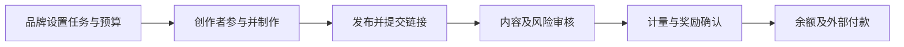
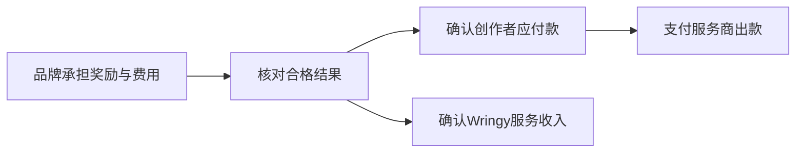
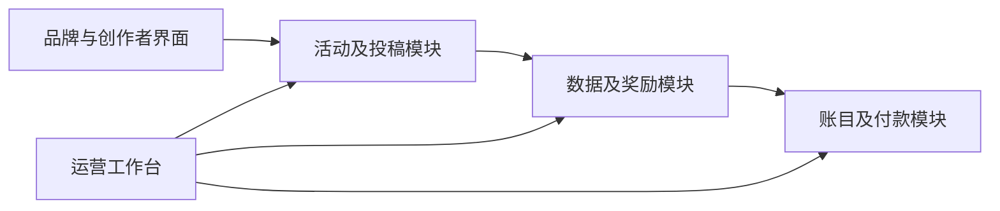

# Whop 内容奖励机制与 Wringy 产品落地报告

> 2026-09-12后续核查：当前V2公告正文的创作者费率已更新为10%及大额按帖／周期免收费，搜索摘要仍可能显示旧阶梯。本报告9月11日的版本差异描述保留历史，最新费率证据见[Content Rewards首发研究](../../deliverables/content-rewards-business-v1/research/findings.md)。首发预算也已改为Prototype＋可用Beta研发上限RM50,000；下文旧资金／成本情景不是当前融资计划。

## 1. 核心判断

Wringy 最值得借鉴的是 Whop 把交易、交付和增长连接起来的方式，以及 Content Rewards 把品牌预算变成创作者任务的运营机制。首版应先跑通一笔有证据、可解释、可结算的创作者奖励，再扩大活动数量。课程、店铺、会员和联盟推广仍是长期产品方向；它们各有不同的付费和履约条件，不宜同时进入首发范围。

**建议的首版定位：面向马来西亚品牌的内容奖励平台。** 品牌提供有授权的素材、明确的任务和奖励池；创作者发布符合约定的内容；Wringy核对内容、记录数据、计算应付奖励并组织付款。这是产品提案。首批品牌细分、计酬规则和正式收费尚未批准，也没有已核验的客户复购数据。

当前研究给出四个直接影响投资叙事和开发的结论。

1. **先分清研究对象。** Whop平台、Whop自有Content Rewards Program、Content Rewards内嵌体验和独立网页体验，不能当作同一份规则。现行CR文件明确其与Whop的公司及职责边界，也保留旧体验接受过的条款。[^R01][^S04]
2. **先定义什么结果值得付款。** 原始播放、特定地区播放、独立观众、点击和订单是不同指标。公开社交接口能提供的字段有边界；没有字段或授权时，页面不能显示“已验证马来西亚真实观看”。[^M10][^M17][^M23]
3. **先把审核与钱分开。** 内容是否符合任务、数据是否完整、是否有风险、奖励是否确认、银行是否到账，是不同判断。Wringy应让用户知道每笔款卡在哪一步、谁负责、下一步是什么。
4. **先验证收费能覆盖履约成本。** 品牌充值不是平台收入。审核拒稿、处理申诉、支付失败和数据故障都会花钱；只按成功作品估成本，会夸大毛利。

研究核查截至2026年9月11日，时区Asia/Kuala_Lumpur。证据来自当前官方文档、条款、定价及公开活动；另检查了两张Mobbin历史屏幕和两张当前公开网页截图。没有完成登录后建活动、付款、社交授权或银行到账实测。下文明确区分**官方声明、公开界面观察、分析判断、Wringy提案、待验证事项**；不把研究稿视为已经批准的产品规格。

## 2. Whop整体商业系统：Wringy以后可以如何扩展

Whop的官方开户说明区分两类商家：在平台建立并交付数字产品，或只使用其收款能力、在别处交付。课程说明则把课程、论坛、聊天、店铺与免费／一次性／订阅定价组合起来。分析上，Whop不是单一课程工具，而是商家经营数字业务的一组连接能力。[^S09][^S10]

下表是用于Wringy规划的**业务分组**，不是Whop内部组织图，也不是对全部功能逐项验收。现有12板块产品总图继续保留；本轮深入到可决定首版规则的部分是Creator Rewards。

| 商业板块 | 谁得到什么价值 | 与首版Wringy的关系 |
|---|---|---|
| 商家身份、组织与经营空间 | 商家设置业务；团队在自己的范围内工作 | 先做品牌归属、成员权限，代理商多客户管理后续再加 |
| 商品、方案与访问权 | 买家支付后获得约定商品或服务访问 | 以后课程／会员会用到；不把奖励投稿当成购买订单 |
| 内容与社区交付 | 课程、聊天、论坛承接购买后的体验 | 保留方向；首版只需任务素材与审稿沟通 |
| 店铺与发现 | 让买家或参与者找到合适的机会 | 首版先做活动列表、详情与邀请入口 |
| 联盟推广 | 推荐者促成销售后取得佣金 | 与“创作者发布内容按量获奖”分开建规则 |
| Creator Rewards | 品牌购买约定的内容产出或传播结果 | 首版核心：活动、投稿、计量、审核、奖励 |
| 收款与出款 | 完成商家收款和参与者付款 | 使用经批准的外部服务；Wringy保留业务账目 |
| 经营数据与支持 | 解释收入、交付、退款和异常 | 首版必须包含运营工作台，不能只做品牌和创作者两端 |
| 开发者与应用扩展 | 第三方连接能力、构建应用 | 将来再开放；首版先保持内部边界清楚 |

商品、定价方案与交付体验在Whop公开API中是分别描述的对象；联盟API按推荐销售归因并计佣。这个区分值得保留：同一个创作者可能既卖课程，又参与奖励活动，但“购买成功获得访问权”和“完成任务获得应付款”不能共用一个完成状态。[^P14][^P15][^P17][^S11]

Whop公开商业价格包括交易处理费用，并可能叠加国际卡、换汇和出款项目；具体产品、地区和合同影响报价。这些是Whop收费能力的证据，不能推导其真实收入结构占比、净利润或Wringy可赚的支付差价。CR的活动平台费也不等于Whop的支付处理费。[^S03]

**增长逻辑是一个待验证的循环。** 更多持续付费的品牌可能带来更稳定的创作者机会；优质交付和可信结算可能促成品牌复购。Wringy必须验证这个循环，而不能只用注册人数声称已有网络效应。Belcort可以提供初始场景和开发能力，但关联公司购买不能替代外部客户需求证据。

## 3. 最新版与旧版：哪些机制可以采用证据，哪些不能

当前可见的编号发布公告是2026年8月19日的“V2 is here”；9月3日更新的条款进一步描述了独立网页体验。发布日期不是线上软件构建号，公告出现过某个功能也不等于本轮已操作验证。[^S05][^S06]

| 对象／材料 | 本轮可以确认的范围 | 使用方式 |
|---|---|---|
| Whop平台官方文档 | 经营、支付、会员及公开接口能力 | 用于理解平台边界和候选依赖 |
| Whop自有Content Rewards Program条款 | 自有项目的付款条件 | 单独保留，不代替CR历史接受合同 [^R07] |
| Whop内嵌应用教程 | 添加应用、设置活动、充值等文字路径 | 作为特定体验说明，不宣称是独立站创建向导 [^S07] |
| CR独立网页当前文件 | 当前活动、费用、审核和角色声明 | 优先说明新活动；仍需识别文件间未解释的差异 |
| Mobbin两张历史屏幕 | 旧活动详情及旧投稿表可见内容 | 仅作旧界面参照，不能补全当前登录后流程 [^P11][^P12] |
| 当前发现页与公开活动 | 可见筛选、奖励展示、素材和加入入口 | 是实际公开观察，不能证明内部结算准确 [^P07][^P08] |

研究识别出六项不能静默“统一”的差异。

| 问题 | 公开材料差异 | Wringy应吸取的教训 |
|---|---|---|
| 自动审核 | 2025教程谈48小时自动处理；当前组织条款要求人工，待审持续到有人处理 | 自己明确人工时限、逾时升级，不复制旧承诺 [^R08][^R02] |
| 创作者收费 | V2公告的7%及阶梯，与当前10%及特定大预算免收费不同 | 每次加入保存接受的费率版本 [^S06][^R05] |
| 结算时钟 | 公告的15分钟／三日周期，与现定价按不同活动类型说明的时钟不同 | 分开计量结束、验证结束、余额可用、银行到账 [^R05] |
| 额外费用 | 品牌定价页称无其他费用，组织合同仍列第三方处理费 | 付款确认必须逐项显示最终金额 [^R04][^R02] |
| 活动要求 | 内嵌教程允许外部文档动态更新；独立站合同限制拒稿依据为平台内要求 | 在Wringy固定参与时的规则副本 [^S07][^R02] |
| 权限与功能发布时间 | 公告与当前条款对角色变更权限有差异；公告尚未提供的CSV不证明今天仍缺失 | 以实际验收过的权限表和功能清单为准 [^S06][^R02] |

另一个值得警惕的细节是V2公告的处理费算例：若分母为10,000美元，2.7%加0.37美元等于270.37美元，文中约307美元缺少可解释的分母或额外项目。报告不把307美元用于财务模型。这个算术问题也说明：即使是官方文案，金额仍需独立核对。[^S06]

## 4. 品牌、创作者与平台，怎样完成一场活动

以下先整理CR公开可知的业务顺序。它是跨文档的关系图，**不是逐屏实测录像**。匿名品牌入口通往预约演示，注册入口出现邮箱弹窗；本轮未验证品牌自助开户的完整步骤。销售表单的预算和目标问题，也不能直接当成正式创建活动的必填字段。[^P09][^P10]

图中是责任衔接，计量、内容审核和风险检查可以并行；真正成立付款义务的条件仍须以对应活动规则为准。

### 4.1 品牌端

品牌首先需要明确自己购买什么：按播放计酬、按作品支付，还是周期合作。CR创作者说明列出这三类机会；组织功能和预审能力则见V2公告。预算、角色和创作者关系属于业务组织，不能只系在某个员工的个人账号下。[^P02][^S06]

| 阶段 | 公开资料能支持的内容 | 仍未验证 |
|---|---|---|
| 建立业务归属 | 品牌／代理工作空间、成员与客户范围 | 真实邀请顺序、转移所有权流程 |
| 配置活动 | 内容类别、申请控制、素材、预审等声明 | 完整创建表、字段依赖、每项默认值 |
| 充值发布 | 内嵌教程描述待预算到活跃的路径 | 当前独立站充值账单与失败重试 |
| 审核交付 | 草稿反馈与公开稿审核分开 | 全部按钮、超时提示与通知触发 |
| 查看经营结果 | 代理页描述活动／平台／日维度分析 | 下载列、计算口径与真实数据延迟 |
| 收尾 | 处理在途交付、奖励、剩余预算 | 实际退款到账及个别争议结果 |

以上是公开能力边界，主要来自当前代理说明及产品公告。[^P03][^S06] 对Wringy而言，建活动界面最终需要表达的是一份可履约约定；漂亮的表单只是它的呈现方式。

### 4.2 创作者端

当前发现页可观察到Clipping、UGC等内容筛选，以及三种计酬模式；活动样本显示平台费率、上下限和素材链接。Clipping是把有授权的现有素材剪成短视频；UGC在此指创作者为活动制作的原创内容。这两类制作方式与“按量／按帖／周期”计费方式是两个维度。[^P07][^P08]

创作者可能直接加入，也可能先申请；需要预审的活动会先上传未发布草稿、处理修改，再发布并交链接。当前帮助页要求发布后30分钟内提交，但本轮未找到足以断言“迟交一定自动扣款”的对应执行证据。平台声明使用只读社交授权或账号简介验证码核对归属，不代表能替创作者发布或删除社交平台帖子。[^P02][^S06][^S04]

一个公开案例是Tizz Clipping：活动页显示每千次播放2美元、单稿最低10美元和最高200美元。Fishtank的样本则显示同一活动不同社交平台可能有不同费率和上下限。这些是单项报价样本；不是全平台默认价格，也不是马来西亚可接受价格的证据。[^R12][^R13]

### 4.3 平台运营端

Wringy需要第三个工作面：运营人员处理账号异常、数据缺口、风险案件、申诉和付款对账。即使首期由创办人兼任，权限和记录也必须存在。否则品牌端只能看到“已通过”，创作者端只能看到“还没收到钱”，中间无法查因。

建议运营界面围绕待处理事项组织：逾时审稿、数据连接失效、待补证风险案、付款状态不明、退款仍有应付款。每项显示责任人、已等待多久和下一动作。风险评分只能协助排序；本轮没有证据证明CR公开的分数是虚假观看占比，也没有其准确率审计。[^S04]

## 5. 当前CR的收费、计量与控制边界

### 5.1 收费和时钟

| 项目 | 当前公开声明 | 不能外推的部分 |
|---|---|---|
| 品牌费 | 标准10%，认证组织8%；三类最低预算1,000美元 | 精确含费／外加分母、MYR报价、最终处理费 [^R04] |
| 创作者费 | CPM固定10%；按帖／周期预算达5,000美元免创作者费，否则10% | 补资跨线是否追溯、历史活动是否同价 [^R05] |
| CPM结算说明 | 批准起计酬7日，再等待3日 | 不保证第十日银行到账；合同中持续累计与窗口的边界仍需澄清 [^R05][^R01] |
| 按帖／周期 | 按帖批准后付款；周期结束结算 | 附带观看条件、部分交付与预留粒度须看活动合同 [^R05] |
| 转Whop余额 | CR定价称免费、无最低金额 | 外部提款、换汇、银行路线仍受Whop条件影响 [^R05][^S08] |

品牌费到底以创作者毛奖励为分母，还是从含平台费的注资内扣，公开页面缺少足以完整重建账单的等式。因此本报告不声称复原了CR每一笔资金分配，也不把品牌10%加创作者10%直接说成总预算20%的收入。

### 5.2 审核、风险、逆转和退款

现行条款的关键边界可以压缩为四点：品牌负责内容决定；草稿通过不等于公开稿最终通过；开放风险标记暂停结算并由人处理；普通逆转涉及未结算部分，其他欺诈追偿有独立依据。创作者风险申诉每稿一次、目标十个工作日回复，不等于普通拒稿必然享有同样复核。[^R01]

退款方面，待审稿会阻止退款申请，创作者应付款优先，未花余额才进入可退范围；合同保留酌扣未花余额最多20%的安排及不可退的处理费。它们是CR的合同选择，不是Wringy必须复制的合理收费标准。[^R02]

公开资料没有披露完整反作弊供应商、权重、误判率、播放抓取频率或并发预算算法。首页营销对核验能力的描述，与FAQ限定的部分外部核验测试范围应一起阅读。Wringy不能仅凭这类宣传承诺零作弊或保证效果。[^S04][^R09]

## 6. Wringy的商业与盈利模型应该怎样写

本节沿用现有商业模式文件的同一算例，不另立财务预测：**品牌在已确认创作者奖励之外支付平台费，创作者不再被扣一次平台费。15%是演示假设，尚未定价。** 正式模型仍以现有36个月财务表为计算源；本报告没有修改融资需求或回本月份。[^L01][^L03]

### 6.1 一笔奖励怎样流动

**全为假设的单稿例子：** 50,000次符合活动口径的播放，费率RM5／千次，候选奖励为RM250。若规则、上限和预算均允许，确认创作者毛奖励RM250；按演示15%费率，Wringy服务收入RM37.50；品牌承担RM287.50，尚未计税及约定由品牌承担的外部费用。这里的播放不自动等于马来西亚真人独立观看。

若一场活动的创作者奖励池为RM10,000，全部赚取后服务收入为RM1,500，品牌支出为RM11,500，未计税及另列费用。品牌看到“奖励池RM10,000”时，应同时看到总付款预估；不能到付款最后一步才发现它不是总预算。

| 金额名称 | 应当如何理解 | 常见误读 |
|---|---|---|
| 奖励池 | 为创作者履约预留的预算上限 | 全部都是Wringy收入 |
| 已确认奖励 | 已满足约定、应付给创作者的金额 | 品牌一充值就全部成立 |
| 平台服务费 | 对已确认业务收取的服务收入 | 未花预算也自动收费 |
| 可提现余额 | 已满足结算条件的创作者余额 | 内容一批准就已到银行 |
| 品牌总支出 | 奖励、服务费及约定费用的总和 | 只显示奖励池即可 |

实际会计采用总额或净额确认，需要按Wringy承担的履约责任及合同判断；上面的净服务收入是规划假设。奖励资金不能用于支付公司的开发费或日常开销。支付服务商负责的部分与Wringy负责的部分，要在准入和合同验证后写清楚。

### 6.2 毛利、贡献与回本

毛利是服务收入扣除履约销售成本后的余额；毛利率以服务收入为分母。本报告的单场贡献定义为服务收入减可变履约成本及活动转介佣金，尚未扣固定履约、其他固定费用和独立品牌获客成本；它并非在毛利上继续扣减得到。公司回本则看累积可用现金是否覆盖初始投入，三者不是同一个数。

当前财务表的演示输入是每场RM1,500收入、RM600可变履约成本、RM150活动转介佣金，因此单场贡献为RM750，尚未扣独立品牌获客和固定费用。RM600包含审核支持300、数据100、支付150及异常损失50，都是成本占位，未获报价；拒稿和申诉也应进入审核成本。

每月20场的同一模型还含RM2,000固定履约成本：收入RM30,000，履约销售成本RM14,000，毛利RM16,000，毛利率53.33%。这是给定假设下的计算，不是预期真实毛利。RM2,000已包含在现有固定支出模型中，不应再次扣除。

正式预算应分别填入以下驱动因素。尤其是数据授权、监控和风控成本，不能从旧按帖版本报价中推定已包含。

| 成本 | 实际需要收集的证据 | 如何进入模型 |
|---|---|---|
| 人工审核和支持 | 每个投稿及每次申诉的处理分钟数、角色成本 | 全部提交量×处理时间，而非仅成功投稿量 |
| 数据取得与刷新 | 每个平台、账号和视频的请求量、存储许可、供应商报价 | 固定订阅＋用量成本＋故障恢复人工 |
| 支付与换汇 | 真实收款、转账、提款、失败、退款账单 | 按实际费基计入；代收费用不当平台收入 |
| 争议损失 | 拒付、重复付款、无法追回的真实损失 | 单独记账，不能只估正常交易 |
| 品牌获客 | 非关联客户从接洽到付费的成本与复购 | 区分一次获客与每场转介佣金 |
| 开发维护 | Belcort分范围报价、验收与变更成本 | 开发投入、持续维护和运营分开 |

计算公司回本时，先从月服务收入扣履约成本、获客、固定费用、资本支出和适用税，再考虑真实收款时间。奖励池及尚欠创作者的款不计为可用现金。如果没有外部复购、供应商账单和新范围开发报价，任何具体“第几个月回本”都只能是条件情景。

## 7. 马来西亚支付与社交数据：必须先验证的边界

### 7.1 收款和付款是两件事

Whop的支持国家名单包含Malaysia，但Platforms API仍属邀请制，需要用途审核。Stripe文档把Malaysia列为可使用特定Connect收款与分账模式的地区，也描述了平台承担退款和拒付等责任；这不能证明Wringy及其奖励业务已经获批。[^M02][^S02][^M04]

| 候选路径 | 已知能力 | 上线前必须获得的证据 |
|---|---|---|
| Whop Platforms | 连接个人／企业账户、平台付款能力 | Wringy用途准入；MYR完整路径；具体银行、费用、结算及退款责任 |
| Stripe Connect | MY支持相应收款与转账模式 | 所选账户类型和奖励用途批准；来源余额、退款／拒付及创作者入网实测 |
| FPX收款 | MY商户、MYR；可与Connect结合；不等于自动循环扣款 | 本业务配置能否入网；款项来源余额处理；退款时间和费用 [^M05][^M06] |
| DuitNow相关服务 | 商户通过收单伙伴入网；服务种类有区别 | 收单伙伴对本场景的书面确认；收款、分配和创作者代付分别验证 [^M08][^M09] |

**建议：先比较经供应商确认的两条完整路径，再决定支付品牌。** 品牌能刷卡付款、创作者能收银行转账、Wringy能解释失败和退款，这三段缺一不可。公开SDK、支持国家或演示成功都不是完整准入。

首版文案使用“活动预算”“应付奖励”等准确名称；是否可以称为托管、钱包或即时到账，必须有相应产品和合同依据。未来扩展SEA也要逐国验证，不能从马来西亚支持推出整个东南亚都能相同分账。

### 7.2 三个平台的数据不能当作同一种播放

API是平台允许软件读取数据的正式接口；OAuth是由用户授权软件访问其账号数据的机制。取得用户许可、获得应用正式权限、被允许用于商业奖励，是三个需要分别核查的问题。

| 平台 | 官方文档可支持的起点 | Wringy不能默认知道什么 |
|---|---|---|
| TikTok | Display API可查询授权用户的视频及播放等字段；应用需审核 [^M10][^M12] | 逐观看者身份、观看国家、跨视频去重；Research API不能当商业访问替代 [^M13] |
| Instagram | 专业账号的媒体指标；服务第三方账号涉及更高访问权限及审核 [^M15][^M18] | 单条Reel的MY观看数；账号受众比例不能乘视频播放当实测；空数据不等于零 [^M16][^M17] |
| YouTube | 公开视频统计；授权Analytics可以查询兼容的视频／国家聚合报表 [^M20][^M22][^M23] | 所有观众都可见、少量地区必定返回、跨平台真人去重；小样本会隐藏 [^M24] |

YouTube技术上可能更接近地区聚合报表需求，但这只是候选验证顺序，不是商业优先结论。其API还有用途、衍生指标和保存规则；专项例外需要符合条件或获得接受，不能默认适用于Wringy。支付创作者制作内容与奖励用户去刷观看也不能混为一谈，具体按量结算用途需要核查。[^M27][^M28]

**推荐的数据承诺层级：** 先证明某个平台可合法获取“某授权账号、某条视频、某段时间的指标”；再决定是否支持地区条件及异常过滤。若品牌只接受MY受众，而数据无法验证，就暂不销售这种效果承诺。改卖固定作品是另一种商业模式，需要重新批准，不能静默改写Creator Rewards定位。

例如，Instagram账号资料显示60%受众来自马来西亚，而一条视频播放100,000次，不能据此结算60,000次“已验证MY观看”。这个乘法是假设分配，缺乏该条视频的地区证据。界面若需要展示这种估计，必须单独标为估算，不能进入按已验证地区计费的账目。

### 7.3 本地隐私与广告要求应进入产品

马来西亚个人资料保护的告知、目的、安全、保存期限及访问更正原则，意味着Wringy不能无限保存社交授权、审核截图和身份材料。官方已有数据泄露通知、资料保护官及跨境传输等指南；是否适用及如何落实，需按实际实体、处理活动和供应商评估，而不是以团队小为理由跳过。[^M30][^M31][^M32][^M33]

Content Forum的2022注册版准则对商业内容显著披露、与推广相同语言及视频内披露有规定；2025审议材料不能直接当成已经生效的新规则。Wringy的活动模板应提供相应语言的披露要求，并在内容审核中有可检查项目。上线前由本地专业人员确认当前适用规则及合同，而非照搬美国FTC文案。[^M34][^M35]

这些要求会形成真实功能：授权目的说明、连接撤销、数据删除／更正入口、保留期限、案件访问权限、事故记录和广告披露检查。身份文件优先由经批准的支付供应商处理；确有必要在Wringy保存时，另定最小字段、权限及删除规则。

## 8. Wringy首版蓝图：先实现一个可控的奖励闭环

以下全部是**待批准提案**。推荐以马来西亚、单一已验证社交渠道、邀请参与、单一CPM计酬合同开展试点。CPM指每千次约定播放计酬；这里只是优先验证方向，不代表已批准七天窗口、15%费率或特定平台。

### 8.1 首批服务谁

首批客户细分仍未确定。建议优先访谈有稳定长视频／直播素材、具明确使用权、愿意为传播结果付费的品牌或内容团队，因为这个场景更接近现有Clipping流程，也能减少原创拍摄的制作争议。这是选择假设；不能把Shopee、TikTok或某个知名品牌写为合作方。

Belcort可协助招募和测试操作，但真实需求验证至少要包含外部独立品牌。品牌愿意试用、愿意注资、完成后愿意按原价格再买，是三种不同证据。创作者愿意注册也不等于愿意按该费率完成交付。

### 8.2 首版范围

| 必须交付 | 可以人工支持但须留记录 | 后续再做 |
|---|---|---|
| 账号、品牌归属、最小权限 | 品牌资格核查、创作者邀请 | 完整代理商客户树、开放商家市场 |
| 三语入口与偏好语言 | 条款翻译复核、人工支持 | 所有国家、币种与复杂语言工作流 |
| 活动详情、规则版本、奖励池 | 协助品牌建首批活动 | 自动匹配、动态竞价、智能推荐 |
| 授权账号、素材、提交链接 | 数据缺口补证及审核 | 未获权限的平台、自动代发 |
| 内容审核、风险案、申诉 | 人工裁决及合理的逾时升级 | 黑箱“AI自动判真伪” |
| 奖励计算、预算分配、账目记录 | 人工核对付款异常 | 多币种钱包、自建支付网络 |
| 付款状态、退款收尾、运营队列 | 经批准流程下的受控付款 | 自动周期合同、按帖加奖金混合模式 |

最低闭环包括品牌端、创作者端和运营端。人工运营可以降低首期自动化范围，但资金记录、规则版本和权限隔离应从第一天就有；这些不能靠聊天记录拼凑。

### 8.3 建活动之前先冻结这份规则表

每个活动保存自己的规则版本。修改尚未有人加入的草稿可以即时生效；有人接受后，影响费用、指标、时限、内容或授权的修改，应生成新版本并明确适用人群。旧稿继续按原约定处理，除非相关双方以可留证方式接受变更。

| 决定 | 推荐起点 | 批准前要验证的事 |
|---|---|---|
| 购买结果 | 一种授权渠道、明确指标、一个计量窗口 | 数据用途与字段可取得；品牌真的愿意买 |
| 谁能参加 | 邀请／申请后接受；参与前显示资格 | 招募成本和创作者接受率 |
| 计量起点 | 有效链接提交后建立基线，窗口不由品牌审核速度改变 | 发布到提交间播放如何处理；平台数据时间粒度 |
| 计量终点 | 活动约定的固定自然时长；明确时区 | 抓数延迟、补算及最后一次有效观测方法 |
| 最低奖励 | 试点优先不设额外单稿最低门槛 | 小额付款成本；若必须设置，写明未达如何处理 |
| 上限与预算 | 先接受并预留单个创作者的最高奖励额度 | 预算利用率与制作名额的平衡 |
| 收费 | 品牌外加透明服务费；首期不叠加创作者平台费 | 费率支付意愿、实际成本；15%仅演示 |
| 预审 | 简单剪辑默认不强制；有台词／敏感表达时按活动开启 | 预审通过后取消的劳动补偿和最终审稿范围 |
| 审核时限 | 首次处理48小时目标，逾时升级运营 | 人员覆盖、周末值守；不自动承诺付款 |
| 风险与申诉 | 标记与定罪分开；独立复核角色 | 证据可取得、处理时限与误判纠正能力 |
| 内容使用权 | 素材许可、再利用、广告用途、期限分别列明 | 本地合同及品牌需求，避免默认无限授权 |
| 收尾和退款 | 先停新参与，清在途义务，再退可退余额 | 处理费、争议准备金及服务商退款路径 |

**计量窗口与审核时限不能互相拖动。** 例如创作者周一提交，品牌周四才审核，不能未经事先约定就只支付周四以后的播放。建议审核决定是否合格，计量按已接受的起止规则记录；实际起点要根据数据可取性验证后冻结。如果只能取得按日数据，就不能承诺精确到提交秒的结算。

### 8.4 首期为什么建议预留个人奖励上限

开放活动常见的问题是总预算将尽、多个创作者同时产生播放，大家都以为还有钱。Wringy试点可以先用较容易解释的方法：接受创作者时，为其预留可赚上限，超过上限停止产生奖励；未赚到的额度在窗口结束和争议清理后释放。

沿用RM10,000奖励池的假设，最多同时接受20个RM500额度。某人最终确认RM250，就释放余下RM250；有争议的部分仍留在预留中。平台费另行覆盖，不能占用已承诺的创作者额度。每个额度是否只允许一条投稿，也须写进活动规则。

接受名额时还必须约定最迟提交时间、退出方式和逾期后释放额度的条件。未提交就没有计量窗口，因此不能只等待“窗口结束”才释放；有已批准草稿或制作补偿约定的，先处理相关义务。参与额度独立记录，各投稿共用该额度的上限，不逐稿重复预留；最终释放也只执行一次。

这个设计牺牲部分预算周转效率，但能避免首期复杂的并发抢预算。后续若开放无限参与，可以比较按计量批次比例分配或按公开优先序分配；它们会改变创作者的收益预期，必须重新测试和说明。**预留个人额度是Wringy建议，不是本轮确认的CR实现。**

## 9. 全流程状态、异常和验收条件

### 9.1 一张投稿需要几条独立状态

“状态”是系统对事情进展的明确记录。Wringy应避免一个绿色Approved同时表示内容、风险和付款都完成。建议按下列维度显示，并在品牌及创作者视角中选择相关信息。

| 维度 | 建议状态示例 | 用户应得到的解释 |
|---|---|---|
| 参与资格 | 已申请、已接受、未接受、已退出 | 能不能开始、有没有名额和额度 |
| 草稿与成稿 | 待审、需修改、已通过、已拒绝 | 当前是哪一版、违反哪项要求 |
| 数据 | 正常、等待更新、连接失效、证据不足 | 数据截至何时、用户能做什么 |
| 风险案件 | 无开放案件、待补证、审核中、已解除、已成立 | 这是风险调查而非观看扣减百分比 |
| 参与额度 | 已预留、部分使用、待释放、已释放 | 参与者全部投稿合计可用的上限；没有投稿也可能有额度 |
| 单稿奖励 | 估算中、待验证、已确认、已调整 | 当前数字是否已经形成应付款，与参与额度分开记录 |
| 外部付款 | 未请求、处理中、成功、失败、状态待核对 | 是余额问题还是银行处理问题 |

状态名最终在PRD中定稿；这里没有创建新组件或替换现有Design System。操作记录至少包含操作者、时间、对象版本、理由和相关证据。钱已确认后发生修正，应保留调整记录，不能直接覆盖原金额让历史消失。

### 9.2 品牌、创作者、运营的验收旅程

| 旅程 | 必须可演示的起点到终点 | 成功证据 |
|---|---|---|
| 品牌 | 选择工作空间→配置规则／奖励池→确认总价→支付结果→接受参与者→审稿→查看使用与余额 | 规则、预算、费用和每次决定均能追溯 |
| 创作者 | 选择语言→读规则→申请／接受→连接账号→制作／预审→交链接→查看收益→收款 | 看得懂下一动作；原输入、规则版本和奖励依据不丢失 |
| 运营 | 找到逾时／风险／数据故障→补证或复核→记录决定→核对付款→关闭案件 | 无越权访问；有理由、责任人和完整资金对账 |
| 退出与收尾 | 暂停活动／断开账号／退款申请→识别在途义务→完成剩余处理 | 停新任务不抹掉已承担的付款责任 |

### 9.3 必须进入规格的十个边界场景

下表是Wringy验收草案，不是CR真实测试结果。每个场景都应有可检查的输入、结果和记录，不只画一个错误提示。

| 场景 | 预期处理 | 不能出现的结果 |
|---|---|---|
| 同时接受最后两个名额 | 只接受预算能够覆盖的额度；失败方得到清楚说明 | 奖励池被重复承诺 |
| 同一链接重复提交或连续点击 | 返回同一份投稿，保留已有处理 | 两份奖励、两次付款 |
| 品牌迟迟不审 | 提醒并升级；计量边界按原规则 | 通过拖延让创作者无声损失播放 |
| 草稿已过、公开版改内容 | 关联版本差异，按原要求复核并给补正路径 | 草稿通过被误读为无条件付款 |
| 外部文档临时加要求 | 当前稿按已接受规则处理 | 用未接受的新要求拒稿 |
| 接口停摆或账号断开 | 区分平台故障和用户撤销，标明最后数据及补证期限 | 缺数据自动算零或自动认定作弊 |
| 风险案在付款前出现 | 仅暂停相关争议款，其他无争议款继续适用流程 | 冻结整个人全部历史收益却无理由 |
| 创作者删帖／转私密 | 依事先公布的保留义务、有效证据和补救规则处理 | 删除与技术故障采用同一处罚 |
| 支付请求超时 | 先查询原请求及对账，再决定是否重试 | 页面重试造成重复付款 |
| 品牌暂停、退款或拒付 | 分别记录普通退款、争议、应付及服务商结果 | 直接清空全部稿件和已确认债务 |

每个失败流程都要说明用户是否能修复、谁会跟进及何时更新。付款成功通知如果先于外部可靠确认到达，是重大验收失败；这类问题优先级高于新增搜索筛选或仪表盘动画。

## 10. 产品设计与Belcort技术地基

### 10.1 设计系统已经能支持什么

现有Design System 2.0提供Linear＋shadcn方向的组件与状态样式，已有中性色、主操作、提醒、阻断、信息及成功的颜色分工。语言规范已包含English、Bahasa Melayu及简体中文，以及首次使用询问偏好、允许跳过、以后可修改的方向。它们是设计基础，不代表真实账号已保存语言，也不代表完整业务流程已实现。[^L02]

下一步不需要重新设计一套按钮。应把第9节的业务状态映射到现有组件，先画三条完整旅程，再检查移动端、键盘访问、三语长度和失败恢复。例如“待补证”用提醒色、图标和文字一起表达；侧栏选中用中性色，避免整页绿色把真正需要处理的事项淹没。

**语言偏好与履约语言要分开。** 用户可以把界面切到BM，但已接受的活动规则版本不能因此变化。通知应跟随偏好语言，进入页面后保留任务上下文和未保存输入。浏览器语言可以建议选项，不能依据姓名、族群或地区替用户决定。

| 页面组 | 首版关键内容 | 必须设计的状态 |
|---|---|---|
| 入门与设置 | 语言偏好、角色、品牌／创作者资料 | 跳过、保存失败、会话恢复、切语言保留输入 |
| 活动发现与详情 | 资格、费率、剩余额度、时限、规则及权利 | 无结果、名额满、已结束、无权限、翻译待确认 |
| 品牌活动编辑 | 指标、渠道、预算、要求、素材、预审 | 草稿、校验失败、支付处理中、修改影响既有参与者 |
| 创作者工作区 | 我的任务、版本、链接、数据及下一动作 | 待审、修改、重复链接、连接失效、迟交 |
| 审核工作区 | 原规则、素材版本、内容、反馈、案件 | 内容通过但风险未清、证据不足、逾时、权限不足 |
| 奖励与付款 | 估算／确认金额、费用、时间线、收款结果 | 可提现、处理中、失败、状态待核对、调整 |
| 运营与支持 | 逾时队列、风险、申诉、退款、对账 | 无负责人、待补证、升级、解决、重新开启 |

上表定义业务页面需要什么，不宣称所有页面都已完成。组件库覆盖许多控件，与首版流程具备可交付性，是两次不同验收。

### 10.2 建议的技术结构

建议Belcort采用**模块化单体**：先在一个应用中清楚划分职责，不急着拆成许多独立服务。这样可以降低部署复杂度，同时让奖励计算、支付和内容审核有明确边界。下图是Wringy建议架构，绝非Whop内部架构复原。

| 模块 | 核心责任／记录 | 不应越界做什么 |
|---|---|---|
| 身份与组织 | 用户、品牌、成员权限、语言偏好、同意记录 | 不因前端隐藏按钮就认为权限已限制 |
| 活动与参与 | 活动版本、资格、名额、规则接受、预算额度 | 不直接覆盖已接受的经济规则 |
| 素材与投稿 | 授权资产、草稿版本、链接、作者归属、反馈 | 不把拥有文件等同于拥有商业使用权 |
| 社交数据 | 授权连接、读取时间、原指标、缺口与来源 | 不把接口返回的播放直接标成真人合格播放 |
| 计量与奖励 | 已批准规则、窗口、上限、可复算结果 | 不直接向银行发款 |
| 审核与风险 | 内容决定、风险案、补证、申诉、操作者 | 不擅自改账目余额作为处罚 |
| 账目与付款 | 预算预留、应付、费用、调整、外部请求、对账 | 不让同一付款重试产生新的业务义务 |
| 通知与审计 | 事件、语言模板、投递、操作记录 | 不先发“到账”消息再等确认 |

账目建议采用可平衡的记录：每次变动能解释钱从哪类余额转到哪类余额，调整有对应记录，历史不可无声改写。支付请求应有唯一业务编号；同一编号无论重试多少次，最多产生一笔同义付款。外部通知可能重复或乱序，因此确认前还须核对可靠状态。

数据保留不能简化成“全部永久保存”。社交平台原始数据、用户授权、财务记录和争议证据适用条件可能不同。Belcort需在架构规格中列每类数据的用途、访问角色、刷新／删除期限和依据；若平台条款限制留存，就设计允许的证据记录，而不是用财务审计作无限保存理由。

### 10.3 哪些买、哪些自己做

建议采购身份与支付等成熟基础服务、对象存储及必要监控，自己建设Wringy的活动约定、参与额度、审核工作台和奖励规则。社交连接优先使用获准接口或经核验的供应商；不能用未经许可的抓取承诺稳定计费。

具体前后端框架、数据库和供应商此时仍未冻结。选择应服从上述边界以及Belcort维护能力；公开Whop API只能证明可集成能力，不能当作其内部技术栈的证据。[^S01]

Belcort虽由同一创办人拥有，仍建议交付独立范围和市场化报价。报价拆成基础闭环、每增加一个社交渠道、自动化风控、周期合作及后续维护；每项写明验收、外部审批依赖和排除项。公司间开发成本和未来融资用途也要可解释，不能只因为关联关系而省去记录。

## 11. 先做哪些验证，再投入开发

建议先给证据验证一个约两周的工作窗口。这是内部计划估算，供应商与应用权限审批可能更久；两周到期交付的是“支持或否定首版选择的证据”，不是保证公开上线。

### 11.1 八项上线前门槛

| 门槛／负责人 | 应收集的材料 | 通过条件 |
|---|---|---|
| 需求／创办人 | 5个独立品牌访谈、至少2份具体预算及试点意向 | 至少有人愿意为明确结果承担真实费用；不能只有赞同概念 |
| 供给／运营 | 10–20位合适创作者对费率、素材、授权和时间的反馈 | 能招到足以完成首场任务的人；拒绝原因记录完整 |
| 支付／创办人＋供应商 | 用途批准、资金路径、费用表；授权后的小额完整测试 | 收款、应付、出款、退款及失败均可对账 |
| 数据／Belcort | 第三方账号生产权限、字段、时间粒度及用途依据；所需YouTube衍生／留存条件 | 权限与必要许可已落实；撤权、刷新、删除验证通过；奖励可复算。缺授权不能靠数据降级放行 |
| 商业规则／创办人 | 第8节每项决定、合同版本与算例 | 无模糊分母、无限付款义务或未说明的扣款条件 |
| 运营／负责人 | 十个边界场景的演练、值班及升级安排 | 没有无人处理的资金／申诉队列 |
| 本地义务／相关专业人员 | 条款、授权、披露、隐私、税务及资金责任审阅 | 实际业务条件有明确处理方案，不靠竞品条款替代 |
| 经济性／创办人＋Belcort | 新范围报价、处理工时、支付／数据账单、试点损耗 | 能计算真实单场贡献及现金需要，知道扩大后哪项成本先失控 |

上表样本数量是研究建议，不是统计显著性的保证，也不是已有客户。关联品牌测试与外部品牌证据分开标注；即使一个活动赚取了利润，也不能据此证明规模化可行。

### 11.2 一场试点应该记录什么

品牌侧记录从提案到付款的转化、预算用途、对结果的接受度及是否愿意复购；创作者侧记录邀请到参与、参与到有效交付、拒绝原因与实际赚取。运营侧记录每稿人工分钟数、数据缺失率、争议处理时间、预算未用比例和付款失败。

这些指标需要明确分母。例如有效交付率以所有正式接受任务的参与者为分母，不能只统计已提交的人；审核成本包含被拒稿和申诉；复购以具备再次购买机会的外部品牌为分母。留存窗口尚未成熟时，报告样本和时间，不包装成稳定月留存。

试点后可能有三种结果。品牌愿意买、数据可核对且单位经济性合理，就扩大同一场景；品牌愿意买但地区数据不可验证，就调整承诺或渠道并重新征得同意；品牌不愿为该结果付费，就回到问题选择，避免仅靠加功能补救。

## 12. 这个milestone怎样才算把地基打好

设计系统是目前已有的地基。现有商业模式已转向合格播放／效果，但旧PRD和架构仍是固定按帖UGC候选；本报告填补当前机制研究和落地建议，**没有把旧稿自动升级成可开工规格**。[^L01][^L02]

接下来应按以下顺序，把研究变成可以由Belcort报价和验收的文件。PRD是说明为谁做、做什么、做到什么程度的产品需求文件；架构规格说明系统职责如何划分、数据和外部服务怎样连接。

| 次序 | 交付物 | 这一层完成的标准 |
|---|---|---|
| 1 | 首版业务规则与决策记录 | 受众、指标、计量、预算、费用、审核、授权和退款有单一解释，创办人记录批准 |
| 2 | Creator Rewards PRD | 三角色正常及异常旅程、字段、权限、成功指标、非目标及可检查验收完整 |
| 3 | 完整交互原型 | 现有设计系统套入真实流程；三语、移动端、注意状态和恢复路径可演示 |
| 4 | 领域与架构规格 | 数据对象、状态转移、预算约束、账目、接口与权限能对照PRD；外部依赖有验证结论 |
| 5 | Belcort分期范围和报价 | 每一阶段有验收、成本、责任、审批依赖；首条闭环先交付 |

规则、PRD和原型可以迭代联动，但涉及钱和权限的开发须在对应规格批准后开始。单纯把所有页面画好，不足以证明这五层完成；反过来，也不必为了长期课程、店铺和会员，把第一期所有细节全部设计完。

**建议的下一项工作：把第8、9节变成一份Creator Rewards首版规则草案与PRD。** 先做能从“品牌发布任务”走到“创作者收到有依据的报酬”的完整旅程，再用设计系统产出页面。数据与支付验证并行推进，未获批准的依赖明确留在规格中，不能假装已经解决。

## 附录A. 尚未被公开证据回答的问题

| 范围 | 仍未知 | 对Wringy的影响 |
|---|---|---|
| CR当前后台 | 完整开户、建活动、成员变更和全部通知链 | 不做逐屏一比一复制承诺 |
| CR计量 | 批准前播放、七日后累计、暂停补算、抓数频率及地域准确性 | 自己固定可验证的计量合同 |
| CR经济规则 | 品牌费精确分母、完整处理费、补资跨优惠线 | 不声称已复原其账单或毛利 |
| CR风控 | 供应商、模型、误判率、观看去重算法 | 不复制评分数值或承诺零作弊 |
| CR预算 | 并发分配及周期预留的具体实现 | Wringy先选能解释并验收的分配方式 |
| MY落地 | Wringy实体、场景及各渠道正式准入 | 供应商书面确认和实际测试前不上线收付 |
| 业务需求 | 首批细分、愿付价格、长期复购 | 外部品牌试点，关联测试单列 |
| 真实经济性 | 新范围开发、数据、支持、损失及获客成本 | 继续用情景，不把回本月份当事实 |

本次研究未联系品牌、创作者、支付服务商或CR支持，也未改变任何账户或资金。未来若取得授权账号及供应商回复，应将证据追加到原来源台账，并更新受影响的规则；旧截图和旧教程不补作当前实测。

## 附录B. 来源与项目依据

以下按正文首次出现顺序编号。外部来源均于2026年9月11日访问；“未标日期”不以搜索抓取日冒充发布日期。条款是公开规则声明，营销页是平台自述，活动页和截图只证明可见内容。完整来源台账及逐项观察保存在本报告随附的inputs目录。

[^R01]: Content Rewards Inc，《Creator Terms of Service》。日期：2026-09-03；访问：2026-09-11。当前CR web合同；Scope保留Whop-hosted已接受旧合同。章节：Scope; §§3–11,13.4,14,16,31。 原始来源：https://contentrewards.com/terms

[^S04]: Content Rewards Inc，《Privacy Policy》。日期：2026-09-03；访问：2026-09-11。Whop-hosted与独立web两个体验并存，CR与Whop职责不可混同。。 原始来源：https://contentrewards.com/privacy-policy

[^M10]: TikTok，《Query Videos》。日期：实时HTTP正文2026-08-24；web检索版2026-08-19，版本差异保留；访问：2026-09-11。Display API v2 / video.list。章节：Overview; Request fields。 原始来源：https://developers.tiktok.com/docs/en/tiktok-api-v2-video-query

[^M17]: Meta，《Instagram Media Insights》。日期：未标日期；访问：2026-09-11。端点文档显示v25.0。章节：Limitations; Metrics; Requirements。 原始来源：https://developers.facebook.com/docs/instagram-platform/reference/instagram-media/insights/

[^M23]: Google，《YouTube Analytics API: Channel Reports》。日期：2026-09-10；访问：2026-09-11。YouTube Analytics v2 channel reports。章节：User geography / User activity by country。 原始来源：https://developers.google.com/youtube/analytics/channel_reports

[^S09]: Whop，《Launch Your Business》。日期：未标日期；访问：2026-09-11。官方商家入门；平台交付与只处理支付两类路径。 原始来源：https://docs.whop.com/launch-your-business

[^S10]: Whop，《Educational Programs》。日期：未标日期；访问：2026-09-11。课程、论坛、聊天、店铺及定价的组合能力。 原始来源：https://docs.whop.com/supported-business-models/educational-programs

[^P14]: Whop，《Product - Whop Docs》。日期：未标日期；访问：2026-09-11。Current public Whop API reference; no API call。章节：Product definition。 原始来源：https://docs.whop.com/api-reference/products/product

[^P15]: Whop，《Experience - Whop Docs》。日期：未标日期；访问：2026-09-11。Current public Whop API reference; no API call。章节：Experience definition; products。 原始来源：https://docs.whop.com/api-reference/experiences/experience

[^P17]: Whop，《Create plan - Whop Docs》。日期：未标日期；访问：2026-09-11。Public API reference only; no mutation。章节：Opening definition。 原始来源：https://docs.whop.com/api-reference/plans/create-plan

[^S11]: Whop，《Affiliates》。日期：未标日期；访问：2026-09-11。公开联盟归因与佣金接口；不等于CR按播放计酬。 原始来源：https://docs.whop.com/developer/guides/affiliates

[^S03]: Whop，《Pricing built for scale》。日期：未标日期；访问：2026-09-11。普通国内卡费2.7%+$0.30，国际卡及FX另计；不是CR活动服务费或马来西亚具体报价。。 原始来源：https://whop.com/network/pricing/

[^S05]: Content Rewards Inc，《Articles》。日期：未标日期；访问：2026-09-11。当前列表可见最新编号发布公告Aug19V2，不证明最新软件构建号。。 原始来源：https://contentrewards.com/articles

[^S06]: Content Rewards Inc，《V2 is here》。日期：2026-08-19；访问：2026-09-11。组织、预审、周期任务发布声明；15分钟、费率等需与现行合同交叉核验；计算示例基数存在未明之处。。 原始来源：https://contentrewards.com/articles/v2-is-here

[^R07]: Whop，《Whop Content Rewards Terms and Conditions》。日期：未标日期；访问：2026-09-11。Whop自有Program条款；不等于CR旧Clippers接受副本。章节：Introduction; For Sellers 2–6; For Participants 3,5,6。 原始来源：https://whop.com/content-rewards-terms-of-service/

[^S07]: Whop，《Content Rewards》。日期：未标日期；访问：2026-09-11。当前可访问内嵌教程：字段、最低奖励进入审核队列、充值路径；不能套作独立web逐屏流程。。 原始来源：https://docs.whop.com/memberships-and-access/third-party-apps/content-rewards

[^P11]: Mobbin，《Whop — Campaign Details (Mobbin screen)》。日期：未标日期；访问：2026-09-11。Historical Whop embedded screenshot; capture date/version unavailable。章节：Campaign Details; Requirements; left navigation。 原始来源：https://mobbin.com/screens/5e3e2301-d019-406e-86f3-12213069a8ef

[^P12]: Mobbin，《Whop — submission modal (Mobbin screen)》。日期：未标日期；访问：2026-09-11。Historical Whop embedded screenshot; capture date/version unavailable。章节：Submission checklist modal。 原始来源：https://mobbin.com/screens/c525bd50-9f35-4d56-8804-77d9e91012d3

[^P07]: Content Rewards，《Discover Campaigns | Content Rewards》。日期：未标日期；访问：2026-09-11。Anonymous live desktop web, 2026-09-11; screenshot and accessibility inspection。章节：Content style tabs; Filter dropdown; campaign cards。 原始来源：https://contentrewards.com/discover

[^P08]: Content Rewards，《Boxabl Official Clipping by Clip Farm | Content Rewards》。日期：未标日期；访问：2026-09-11。Anonymous current public campaign sample and help widget。章节：Campaign detail; Reference materials; Top earners; Help & support。 原始来源：https://contentrewards.com/discover/188c3e39-7850-4896-94df-e7a5be0cfec3

[^R08]: Whop; East，《How to set up Whop Content Rewards》。日期：2025-05-14；访问：2026-09-11。旧Whop教程，目前网页仍可读取。章节：Content rewards FAQ: AI review; minimum budget。 原始来源：https://whop.com/blog/set-up-content-rewards/

[^R02]: Content Rewards Inc，《Organization Terms of Service》。日期：2026-09-03；访问：2026-09-11。当前CR web品牌/代理合同，旧接受合同保留。章节：§§4–10,18; Scope。 原始来源：https://contentrewards.com/brands-terms

[^R05]: Content Rewards Inc，《Creator Pricing》。日期：未标日期；访问：2026-09-11。当前公开创作者定价；由品牌页For Creators链接直接到达。章节：Keep 100%; Before you ask全节。 原始来源：https://contentrewards.com/pricing/creators

[^R04]: Content Rewards Inc，《Pricing》。日期：未标日期；访问：2026-09-11。当前公开品牌定价；未进入资金充值确认。章节：Get verified and save; Before you ask。 原始来源：https://contentrewards.com/pricing

[^P09]: Content Rewards，《Content Rewards — homepage / signup entry》。日期：未标日期；访问：2026-09-11。Anonymous browser navigation; resolved to https://contentrewards.com/。章节：Signup redirect and email modal; brand launch links。 原始来源：https://contentrewards.com/signup

[^P10]: Content Rewards，《Book a demo | Content Rewards》。日期：未标日期；访问：2026-09-11。Current public lead form; text extraction only。章节：Personal Details; Business Info。 原始来源：https://contentrewards.com/book-a-demo

[^P02]: Content Rewards，《For creators | Content Rewards》。日期：未标日期；访问：2026-09-11。Current public creator landing page / FAQ。章节：FAQ: joining, submitting, rejected, reviewed; campaign model overview。 原始来源：https://contentrewards.com/creators

[^P03]: Content Rewards，《For agencies | Content Rewards》。日期：未标日期；访问：2026-09-11。Current public agency page / FAQ。章节：Reporting; Who approves; More than one client。 原始来源：https://contentrewards.com/agencies

[^R12]: Tizz Clipping，经Content Rewards托管，《Tizz Clipping by Tizz Clipping | Content Rewards》。日期：未标日期；访问：2026-09-11。单一公开活动展示；相对3mo不是准确发布日期或接受版本。章节：活动介绍; 各平台奖励栏。 原始来源：https://contentrewards.com/discover/3537e830-d992-4c19-a2ab-d249c6950f9f

[^R13]: Fishtank，经Content Rewards托管，《Fishtank Live NEW CAMPAIGN by Fishtank | Content Rewards》。日期：未标日期；访问：2026-09-11。单一公开活动展示；相对5mo不证明合同版本。章节：各平台奖励栏; 活动说明。 原始来源：https://contentrewards.com/discover/b7c08b62-405e-4acd-afc0-9eb4f867e5e0

[^S08]: Whop，《Manual Payouts to Connected Accounts》。日期：未标日期；访问：2026-09-11。身份核验、出款方式、余额和费用覆盖前置条件；API示例非实测到账。。 原始来源：https://docs.whop.com/developer/platforms/manual-payouts

[^R09]: Content Rewards Inc，《Content Rewards》。日期：未标日期；访问：2026-09-11。当前营销首页与FAQ；非独立审计。章节：Bot detection; Verification Layer; Before you ask。 原始来源：https://contentrewards.com/

[^L01]: Wringy项目，《Wringy 商业模式与投资叙事依据；旧PRD和架构状态》。日期：2026-09-10；访问：2026-09-11。本地商业方向与假设，不是外部客户证据。 原始来源：${WRINGY_WORKSPACE}/phase-0/foundation/business-model-v2.md

[^L03]: Wringy项目，《Wringy 36个月财务模型口径》。日期：2026-09-10；访问：2026-09-11。假设模型；非新范围报价或真实回本预测。 原始来源：${WRINGY_WORKSPACE}/phase-0/finance/model-v1/README.md

[^M02]: Whop，《Set Up Payouts》。日期：未标日期；访问：2026-09-11。Whop Payments 商家提现。章节：Enable withdrawals; Supported countries。 原始来源：https://docs.whop.com/manage-your-business/manage-payouts/set-up-payouts

[^S02]: Whop，《Connected Accounts》。日期：未标日期；访问：2026-09-11。Platforms功能邀请制，具体用途需销售审核；企业与个人connected accounts角色。。 原始来源：https://docs.whop.com/manage-your-business/manage-payouts/connected-accounts

[^M04]: Stripe，《Create separate charges and transfers》。日期：未标日期；访问：2026-09-11。Connect / Payment Intents API / MY。章节：Supported regions; Cross-border transfers; Transfer availability; Refunds。 原始来源：https://docs.stripe.com/connect/separate-charges-and-transfers.md?platform=web&integration=custom&ui=elements&api-integration=paymentintents

[^M05]: Stripe，《FPX payments》。日期：未标日期；访问：2026-09-11。MY Stripe账户 / MYR / FPX。章节：Payment method properties; Business locations; Refunds。 原始来源：https://docs.stripe.com/payments/fpx

[^M06]: Stripe，《Accept an FPX payment》。日期：未标日期；访问：2026-09-11。FPX / Connect / Elements。章节：Payouts and transfers。 原始来源：https://docs.stripe.com/payments/fpx/accept-a-payment?payment-ui=elements&web-or-mobile=web

[^M08]: PayNet，《Overview — DuitNow Pay registration》。日期：未标日期；访问：2026-09-11。DuitNow Pay。章节：Merchant; Acquirer。 原始来源：https://docs.developer.paynet.my/docs/duitnow-pay/registration/overview

[^M09]: PayNet，《Overview — DuitNow Online Banking/Wallets》。日期：未标日期；访问：2026-09-11。DOBW / DuitNow Pay。章节：Merchant Acquirer; Refund; Related Services。 原始来源：https://docs.developer.paynet.my/docs/duitNow-online-banking-wallets/introduction/overview

[^M12]: TikTok，《App Review Guidelines》。日期：2026-08-04；访问：2026-09-11。TikTok开发者应用审核。章节：Website URL; Scopes; App review information。 原始来源：https://developers.tiktok.com/docs/en/app-review-guidelines

[^M13]: TikTok，《Frequently Asked Questions》。日期：未标日期；访问：2026-09-11。Research API。章节：Research Tools eligibility Q6; Usage FAQ Q3。 原始来源：https://developers.tiktok.com/docs/en/research-api-faq

[^M15]: Meta，《Insights》。日期：未标日期；访问：2026-09-11。Instagram Platform 两种登录路径。章节：Requirements; Access Level; Limitations。 原始来源：https://developers.facebook.com/docs/instagram-platform/insights/

[^M18]: Meta，《App Review for Instagram API》。日期：未标日期；访问：2026-09-11。多企业Tech Provider / Advanced Access。章节：Development scenarios; Complete App Verification。 原始来源：https://developers.facebook.com/docs/instagram-platform/app-review/

[^M16]: Meta，《Instagram Account Insights》。日期：未标日期；访问：2026-09-11。端点文档显示v25.0。章节：Limitations; Metrics; Host path parameters。 原始来源：https://developers.facebook.com/docs/instagram-platform/api-reference/instagram-user/insights/

[^M20]: Google，《Videos: list》。日期：2026-09-04；访问：2026-09-11。YouTube Data API v3。章节：Quota impact; id; regionCode。 原始来源：https://developers.google.com/youtube/v3/docs/videos/list

[^M22]: Google，《Reports: Query》。日期：2026-05-11；访问：2026-09-11。YouTube Analytics API v2。章节：Authorization; ids; endDate; filters。 原始来源：https://developers.google.com/youtube/analytics/reference/reports/query

[^M24]: Google，《YouTube Analytics API - Data Model》。日期：2026-09-10；访问：2026-09-11。YouTube Analytics v2。章节：Data anonymization; Quota usage。 原始来源：https://developers.google.com/youtube/analytics/data_model

[^M27]: Google，《YouTube API Services - Developer Policies》。日期：2026-06-24；访问：2026-09-11。当前API用途/数据保留政策。章节：III.E.4, E.8, F.3, I.14, L。 原始来源：https://developers.google.com/youtube/terms/developer-policies

[^M28]: Google，《Additional policies for derived metrics and data storage》。日期：2026-06-01；访问：2026-09-11。经申请/接受修订的analytics开发者。章节：Acceptable metrics; Financial Performance Projections; Data Storage。 原始来源：https://developers.google.com/youtube/terms/derived-metrics-policy

[^M30]: JPDP Malaysia，《Principles of Personal Data Protection》。日期：未标日期；访问：2026-09-11。Act 709基本原则介绍。章节：Seven principles。 原始来源：https://www.pdp.gov.my/ppdpv1/en/principles-of-personal-data-protection/

[^M31]: Personal Data Protection Commissioner Malaysia，《Personal Data Protection Guideline — Data Breach Notification》。日期：2025-02-25；访问：2026-09-11。Malaysia DBN guideline v1.0。章节：v1.0; §5-9; PDF页7-15。 原始来源：https://www.pdp.gov.my/ppdpv1/wp-content/uploads/2025/08/GP_DBN_ENG.pdf

[^M32]: Personal Data Protection Commissioner Malaysia，《Personal Data Protection Guideline — Appointment of Data Protection Officer》。日期：2025-02-25；访问：2026-09-11。Malaysia DPO guideline v1.0。章节：Version1.0; §4.2-4.3; PDF页5-6。 原始来源：https://www.pdp.gov.my/ppdpv1/wp-content/uploads/2025/08/GP_DPO_ENG.pdf

[^M33]: JPDP Malaysia，《Personal Data Protection Guidelines on Cross-Border Transfer of Personal Data (CBPDT)》。日期：未标日期；访问：2026-09-11。Malaysia跨境资料转移。章节：Official guideline download entry。 原始来源：https://www.pdp.gov.my/ppdpv1/en/akta/personal-data-protection-guidelines-on-cross-border-transfer-of-personal-data-cbpdt/

[^M34]: Content Forum Malaysia，《The Malaysian Communications and Multimedia Content Code 2022, Third Edition》。日期：2022-05-30；访问：2026-09-11。2022注册版自律准则。章节：Part 3 §6.1-6.3; Part 1 §6。 原始来源：https://contentforum.my/wp-content/uploads/2023/05/Content-Code-2022-Third-Edition.pdf

[^M35]: Content Forum Malaysia，《Public Consultation》。日期：未标日期；访问：2026-09-11。2025审议材料状态。章节：Content Code Review 2025。 原始来源：https://contentforum.my/public-consultation/

[^L02]: Wringy项目，《Design System 2.0与本地化基础规范》。日期：2026-09-11；访问：2026-09-11。本地设计交付；语言详细规范位于phase-0/foundation/localization-v1.md。 原始来源：${WRINGY_WORKSPACE}/phase-0/foundation/design-system-v2/README.md

[^S01]: Whop，《Whop Developer Platform》。日期：未标日期；访问：2026-09-11。API公开产品为收款、出款、身份、嵌入聊天及应用；公开能力不等于内部架构。。 原始来源：https://docs.whop.com/
